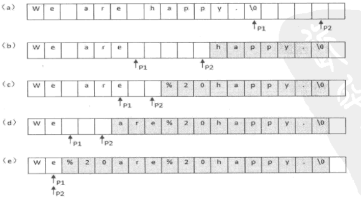

# 005-替换空格

tags： 字符串

---

## 题目原文
[牛客网链接](https://www.nowcoder.com/practice/4060ac7e3e404ad1a894ef3e17650423?tpId=13&tqId=11155&tPage=1&rp=1&ru=/ta/coding-interviews&qru=/ta/coding-interviews/question-ranking)

请实现一个函数，将一个字符串中的空格替换成“%20”。例如，当字符串为We Are Happy.则经过替换之后的字符串为We%20Are%20Happy。

## 解题思路

这道题有几个条件没有说：
 1. str的大小默认足够大，可以容纳替换空格后的字符创
 2. length是str的原长度，不包括'0'
 3. 不许额外分配内存空间

空格是一个字符，%20是三个字符，依次替换后字符串长度会变长。

### O(n^2)的解法
这道题的简单思路就是两层循环，第一层循环从字符串开始处寻找空格，找到空格后进入到第二层循环，替换空格后，将空格后的字符串依次后移。

这种做法理解起来简单，但时间复杂度为O(n^2)，并且后面的字符要移动多次，耗费时间

### O(n)的解法
这道题其实是典型的两指针移动问题。可以先统计出原始字符串中空格的个数，之后计算新的字符串长度。

使两个指针分别指向新旧字符串的最后一个字符，遇见空格就替换并移动指针，否则复制后移动指针。

### 注意

涉及到指针的问题，要避免越界或者访问空指针，所以要判断字符串是否为空


<center><small> 从后向前替换空格过程</small></center>
## 编程知识
### python
#### [python里快速创建指定大小的list的方法](https://bbs.pku.edu.cn/v2/post-read.php?bid=1360&threadid=14398267)

    a=[None]*n
    a=list(range(n))
    a=[None for i in range(n)]

这里第三种形式有用的原因是，Python 里的乘法创建的是实例的引用。也就是说，[list()] * 3 里的（作为元素的）列表，实际是一个实例：修改其中之一，会同步修改到剩余所有的引用。

比如a=[set()]*n，创建出的list中所有元素会指向同一个set()

#### [python中not,and,or的优先级问题及用法](http://blog.csdn.net/qq_28267025/article/details/62044871)

    优先级关系：or<and<not，同一优先级默认从左往右计算

#### [Python核心数据类型——字符串](http://www.cnblogs.com/restran/archive/2011/11/22/2259407.html)

Python中不是用\0来判断字符串结尾，
每个字符串都存有字符串的长度，通过计数来判断是否到达结尾

#### [类型判断type与isinstance的区别](http://blog.csdn.net/handsomekang/article/details/10043633)

type()不会认为子类是一种父类类型。
isinstance()会认为子类是一种父类类型。

需要注意的是，旧式类跟新式类的type()结果是不一样的。旧式类都是<type 'instance'>。

```python
class A:  
    pass  
  
class B:  
    pass  
  
class C(object):  
    pass  
  
print 'old style class',type(A())  
print 'old style class',type(B())  
print 'new style class',type(C())  
print type(A()) == type(B())  
```

输出
old style class <type 'instance'>
old style class <type 'instance'>
new style class <class '__main__.C'>
True

## 代码
### [c++代码](./src/cpp/替换空格.cpp)

```c++
class Solution {
public:
	void replaceSpace(char *str,int length) {
        //这道题里的str，默认在替换空格后足够大，length是str的原长度，不包括最后的'0'
        if (str==NULL&&length<=0)
            return;
        int num=0;
        for (int i=0;i<length;i++){
            if (str[i]==' ')
                num++;
        }
        int len=length+num*2;
        for (int i=length-1,j=len-1;i>=0&&j>=0;i--){
            if (str[i]==' '){
                str[j--]='0';
                str[j--]='2';
                str[j--]='%';
            }else
                str[j--]=str[i];
        }
        str[len]='0';
	}
};
```

### [python代码](./src/python/替换空格.py)

这里的python代码其实效率并不高，这样写的目的是为了实现书中的思路。最简单的思路就是直接调用字符串类型的replace方法
```python
# -*- coding:utf-8 -*-
class Solution:
    # s 源字符串
    def replaceSpace(self, s):
        # write code here
        if not isinstance(s,str) or len(s) <=0 or s==None:
            return ""
        num=0
        for i in s:
            if i==' ':
                num+=1
        newLen=len(s)+num*2
        newStr=[None for i in range(newLen)]
        oIdx,nIdx=len(s)-1,newLen-1
        while oIdx>=0 and nIdx>=0:
            if s[oIdx]==' ':
                newStr[nIdx-2:nIdx+1]=['%','2','0']
                oIdx-=1
                nIdx-=3
            else:
                newStr[nIdx]=s[oIdx]
                oIdx-=1
                nIdx-=1
        return "".join(newStr)
        
```

