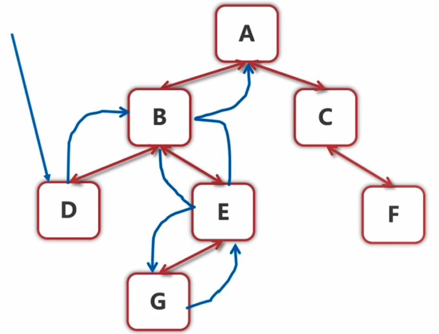
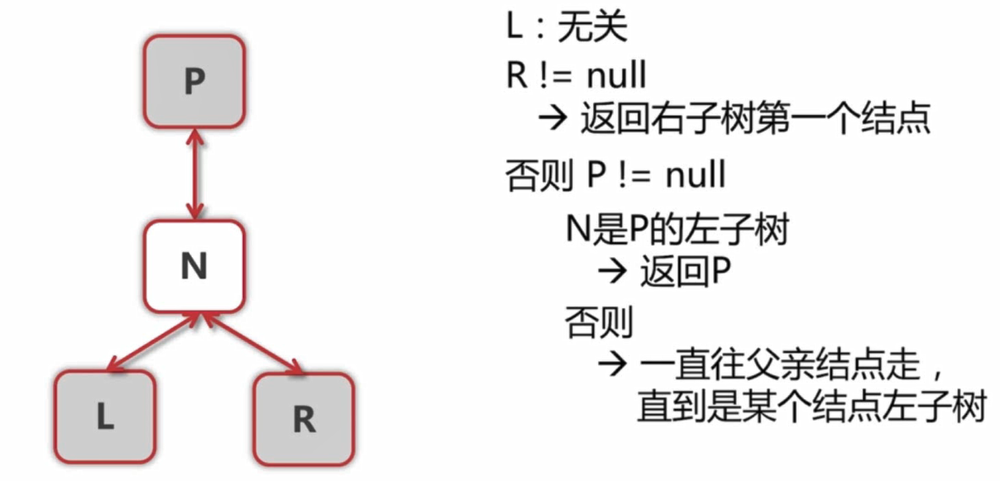

# 008-二叉树的下一个结点

tags： 二叉树

---

## 题目原文

[牛客网链接](https://www.nowcoder.com/practice/9023a0c988684a53960365b889ceaf5e?tpId=13&tqId=11210&tPage=3&rp=1&ru=%2Fta%2Fcoding-interviews&qru=%2Fta%2Fcoding-interviews%2Fquestion-ranking)

给定一个二叉树和其中的一个结点，请找出中序遍历顺序的下一个结点并且返回。注意，树中的结点不仅包含左右子结点，同时包含指向父结点的指针。

## 解题思路

> 参考: [我去个地方啊](https://www.nowcoder.com/questionTerminal/9023a0c988684a53960365b889ceaf5e)

把每个节点看作一个根节点, 考虑其子树和父节点.

中序排序的规则如下图所示




我们从这个图上可以看到，找下一个节点是可以分为几种情况的。

**第一种情况：**

> 就是一个节点有右子树。比如要求节点B的下一个节点，其实是找到它的右子树的最左孩子，就是G节点。

**第二种情况，就是一个节点没有右子树，此时又可以分为两种情况。**

> - 2.1 对于G这个节点来说，没有右子节点了，它的父亲节点是E，G是E的左子节点，即E的左子节点是G，那么G的下一个节点就是E。  
>
> - 2.2 对于E这个节点来说，也没有右子节点，它的父亲节点是B，此时E是B的右子节点，根据实际情况来说，E的下一个节点绝对不是B，因为E是B的右子节点，根据中序遍历的规则，此时肯定是先遍历B再遍历E，所以B肯定在E的前面，而不是后面，所以我们还需要再往上找父亲节点，此时B的父亲节点为A，B为A的左子节点，此时根据实际情况，A就是我们要找的E的下一个节点。

对于第二种情况的两种情况可以合并为一种情况, 即对于一个没有右子节点的节点来说，只需要判断它有没有父节点并且是不是父节点的左子节点，是的话，就找到了，不是则要不断地向上找。如果一直找到根还是找不到，像节点F，那就返回null，因为实际上F节点就是中序遍历的最后一个节点，没有所谓的下一个节点了。

    

  总之，我们不关心当前节点的左子节点，因为它不在我们的考虑范围内，它必定出现在当前节点的前面。 

  我们主要就是考虑有没有右子节点，或者没有右子节点的话就考虑父亲节点。有右子节点比较简单，一直找最左边的子节点即可。但是没有右子节点的时候，就需要去查询父亲节点了。

**注意**

考虑输入节点是根节点或者最后一个节点等情况

## 代码

### [c++代码](./src/cpp/008-二叉树的下一个结点.cpp)

```c++
/*
struct TreeLinkNode {
    int val;
    struct TreeLinkNode *left;
    struct TreeLinkNode *right;
    struct TreeLinkNode *next; //parent
    TreeLinkNode(int x) :val(x), left(NULL), right(NULL), next(NULL) {
        
    }
};
*/
class Solution {
public:
    TreeLinkNode* GetNext(TreeLinkNode* pNode)
    {
        if(pNode==nullptr) return nullptr;
        TreeLinkNode* pNext=nullptr;
        if(pNode->right!=nullptr){
            pNode=pNode->right;
            while(pNode->left!=nullptr)
                pNode=pNode->left;
            pNext=pNode;
        }
        // 我的写法将第二种情况的两小种情况合二为一, 并且可以完美处理输入节点为根节点,或者为最后一个节点的情况.
        else{
            while(pNode->next!=nullptr&&pNode==pNode->next->right)
                pNode=pNode->next;
            pNext=pNode->next;
        }
        return pNext;
    }
};
```

### [python代码](./src/python/008-二叉树的下一个结点.py)

```python

```
