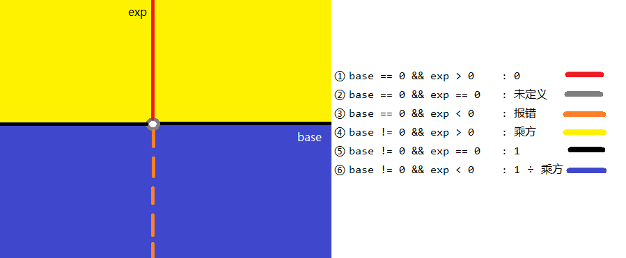
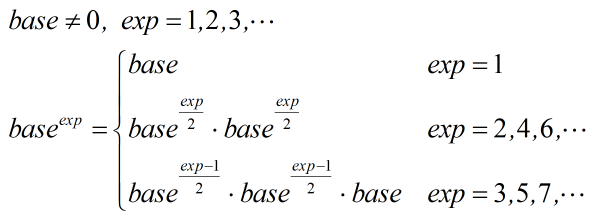

# 016-数值的整数次方

tags： 快速求幂算法

---

## 题目原文

[牛客网链接](https://www.nowcoder.com/practice/1a834e5e3e1a4b7ba251417554e07c00?tpId=13&tqId=11165&rp=2&ru=%2Fta%2Fcoding-interviews&qru=%2Fta%2Fcoding-interviews%2Fquestion-ranking&tPage=1)

给定一个double类型的浮点数base和int类型的整数exponent。求base的exponent次方。

## 解题思路

[参考]([https://github.com/gatieme/CodingInterviews/tree/master/011-%E6%95%B0%E5%80%BC%E7%9A%84%E6%95%B4%E6%95%B0%E6%AC%A1%E6%96%B9](https://github.com/gatieme/CodingInterviews/tree/master/011-数值的整数次方))

[参考](https://www.nowcoder.com/questionTerminal/1a834e5e3e1a4b7ba251417554e07c00)

这道题除了快速求幂算法稍微有些难度, 其余的比较简单. 

这道题考察的是思维的全面性, 一个是要考虑各种情况, 另一个是快速求幂, 在一个是c++的易错点和加速技巧.

### 自以为很简单的解法

```c++
class Solution
{
public:
    double Power(double base, int exponent)
    {
        double res = 1;
        for(int i = 0; i < exponent; i++)
        {
            res *= base;
        }

        return res;
    }
};
```

貌似我们已经完美的解决了问题，但是真的这样么？ 我们输入一个指数为负数的情况

```
    Solution solu;
    cout <<solu.Power(2, -3) <<endl;
```

上面代码没有考虑指数为0或负数的情况

### 全面但低效的办法

指数幂的所有边界包括

- 指数为0的情况，不管底数是多少都应该是1
- 指数为负数的情况，求出的应该是其倒数幂的倒数
- 指数为负数的情况下，底数不能为0

**注意** 0的0次幂在数学上是无意义的, 因此返回0还是1都可以接受, 但是要和面试官说清楚

```c++
class Solution
{
public:
    double Power(double base, int exponent)
    {
        //  指数为0的情况，不管底数是多少都应该是0
        if(exponent == 0)
        {
            return 1.0;
        }
        //  指数为负数的情况下，底数不能为0
        if(Equal(base, 0.0) == true && exponent < 0)
        {
            debug <<"异常, 指数为负数的情况下，底数不能为0" <<endl;
            return 0.0;
        }

        double res = 1.0;
        if(exponent > 0.0)
        {
            res = PowerNormal(base, exponent);
        }
        else
        {
            res = PowerNormal(base, -exponent);
            res = 1 / res;
        }

        return res;
    }

private :
    double PowerNormal(double base, int exponent)
    {

        double res = 1;
        for(int i = 0; i < exponent; i++)
        {
            res *= base;
        }

        return res;

    }
    double Equal(double left, double right)
    {
        if(fabs(left - right) <  0.0000001)
        {
            return true;
        }
        else
        {
            return false;
        }
    }
};
```

### 全面且高效的算法 快速求幂算法

幂运算有如下性质





快速幂乘法有两种实现思路, 一种是循环, 一种是递归

#### 循环

我用的是循环版本

[参考](https://blog.csdn.net/hkdgjqr/article/details/5381028)

快速求正整数次幂，当然不能直接死乘。举个例子：

3 ^ 999 = 3 * 3 * 3 * … * 3

直接乘要做998次乘法。但事实上可以这样做，先求出2^k次幂：

3 ^ 2 = 3 * 3
3 ^ 4 = (3 ^ 2) * (3 ^ 2)
3 ^ 8 = (3 ^ 4) * (3 ^ 4)
3 ^ 16 = (3 ^ 8) * (3 ^ 8)
3 ^ 32 = (3 ^ 16) * (3 ^ 16)
3 ^ 64 = (3 ^ 32) * (3 ^ 32)
3 ^ 128 = (3 ^ 64) * (3 ^ 64)
3 ^ 256 = (3 ^ 128) * (3 ^ 128)
3 ^ 512 = (3 ^ 256) * (3 ^ 256)

再相乘：

3 ^ 999
= 3 ^ (512 + 256 + 128 + 64 + 32 + 4 + 2 + 1)
= (3 ^ 512) * (3 ^ 256) * (3 ^ 128) * (3 ^ 64) * (3 ^ 32) * (3 ^ 4) * (3 ^ 2) * 3

这样只要做16次乘法。即使加上一些辅助的存储和运算，也比直接乘高效得多（尤其如果这里底数是成百上千位的大数字的话）。

我们发现，把999转为2进制数：1111100111，其各位就是要乘的数。这提示我们利用求二进制位的算法（其中mod是模运算）：

REVERSE_BINARY(n)
1 while (n > 0)
2     do output (n mod 2)
3       n ← n / 2

这个算法给出正整数n的反向二制进位，如6就给出011（6的二进制表示为110）。事实上这个算法对任意的p进制数是通用的，只要把其中的2换成p就可以了。

如何把它改编为求幂运算？我们发现这个算法是从低位向高位做的，而恰好我们求幂也想从低次幂向高次幂计算（参看前面的例子）。而且我们知道前面求出的每个2^k次幂只参与一次乘法运算，这就提示我们并不把所有的中间结果保存下来，而是在计算出它们后就立即运算。于是，我们要做的就是把输出语句改为要做的乘法运算，并在n减少的同时不断地累积求2^k次幂。

还是看算法吧：

POWER_INTEGER(x, n)
1 pow ← 1
2 while (n > 0)
3     do if (n mod 2 = 1)
4            then pow ← pow * x
5       x ← x * x
6       n ← n / 2
7 return pow

不难看出这个算法与前面算法的关系。在第1步给出结果的初值1，在while循环内进行运算。3、4中的if语句就来自REVERSE_BINARY的输出语句，不过改成了如果是1则向pow中乘。5句则是不断地计算x的2^k次幂，如对前面的例子就是计算2^2、2^4、2^8、…、2^512。

应该指出，POWER_INTEGER比前面分析的要再多做两次乘法，一次是向pow中第一次乘x，如2^1也要进行这个乘法；另一次则是在算法的最后，n除以2后该跳出循环，而前面一次x的自乘就浪费掉了（也可以考虑改变循环模式优化掉它）。另外，每趟while循环都要进行一次除法和一次模运算，这多数情况下除法和模运算都比乘法慢许多，不过好在我们往往可以用位运算来代替它

注1：快速求幂算法POWER_INTEGER常被写成递归的形式，算法实质完全相同，但却是无必要的。

注2：这个算法并不是做乘法数最少的，但多数情况下是足够快并且足够简单的。如果单纯追求做乘法数最少，则未必应该用2^k次幂进行计算。如果还允许做除法，则问题会进一步复杂化。

#### 递归

[参考](https://www.jianshu.com/p/148006beb244)

递归则是用如下公式

```
base^n = base^(n/2) * base^(n/2)； 
base^n = base * base^((n-1)/2) * base^((n-1)/2)；
```

这样分解下去，就可以把时间复杂度降为`O(logN)`。

```c++
double tiny_pow(double base, int n) 
{
     // 0的0次方极限趋近于1. 0^-1，0^-2会引起CPU异常，所以不作处理
    if (equal(base, 0.0) && n == 0)
        return 0.0;

    unsigned int absN = ( n > 0 ? (unsigned int)n : abs(n) );
    
    double result = powWithUnsignedN(base, absN); 
    if (n < 0)
        result = 1.0 / result;
    
    return result;
}

double powWithUnsignedN(double base, unsigned int n)
{
    if (n == 0)  return 1;

    if (n == 1)  return base;  // 也是递归开始回溯的地方

    double result = powWithUnsignedN(base, n >> 1);
    result *= result ;
     
    if (n & 1)      // n为奇数
        result *= base;
    
    return result ; 
}

bool equal(double num1, double num2) 
{        
    // |num1 - num2| < 0.0000001
    if (-0.0000001 < (num1 - num2) && (num1 - num2) < 0.0000001) 
        return true;
    else
        return false;
}
```

### 总结

#### **思维全面性:**

1. 全面考察指数的正负、底数是否为零等情况。

当底数为0且指数<0时, 会出现对0求倒数的情况，需进行错误处理

2. 0的0次幂在数学上是无意义的, 因此返回0还是1都可以接受, 但是要和面试官说清楚

#### **编程易错点**

1. C++浮点数(float、double)类型数据比较、相等判断

浮**点数**在内存中的存储机制和整型数不同，其有舍入误差，在计算机中用近似表示任意某个实数。**float小数点前后加起来有效数字只有6位**。**double小数前后加起来的有效数字只有16位**

**用"=="来比较两个double应该相等的类型，返回真值完全是不确定的**。计算机对浮**点数**的进行计算的原理是只保证必要精度内正确即可。

我们在**判断**浮**点数相等**时，推荐用范围来确定，若x在某一范围内，我们就认为**相等**，至于范围怎么定义，要看实际情况而已了，float,和double 各有不同
    所以const float EPSINON = 0.00001;
    if((x >= - EPSINON) && (x <= EPSINON) 这样**判断**是可取的至于为什么取0.00001，可以自己按实际情况定义。

​    也可以 abs(x) <= EPSINON

比如要**判断**浮**点数**floatA和B是否**相等**，我们先令float  x = A –B ;

并设constfloat EPSINON = 0.00001;  则

if ((x >= - EPSINON)&& (x <= EPSINON);//或者if(abs(x) <= EPSINON)

cout<<”A 与B**相等**<<endl;

else

cout<<”不**相等**”<<endl;

根据上面分析建议在系统开发过程中设计到字符转换建议采用double**类型**，精度设置为%.8lf即可，在**比较**浮**点数**十建议EPSINON= 0.00000001


2. 

res, cur要初始化为double类型, n要初始化为无符号整数类型

#### 技巧

1. 用位运算判断奇数偶数

```
n&0x01)==1// 等价于 (n % 2) == 1
```

2. 用右移运算符代替除2

```
n >>= 1 等价于 n /= 2
```


## 代码

### [c++代码](./src/cpp/016-数值的整数次方.cpp)

```c++
class Solution {
public:
    double Power(double base, int exponent) {
        double res=1,cur=base;
        unsigned int n;
        if(exponent>0){
            n=(unsigned int)(exponent);
        }else if(exponent<0){
            if(fabs(base-0)<0.00000001)
                throw new logic_error("分母不能为0");
            n=(unsigned int)(-exponent);
        }else{// n==0
            return 1;// 0的0次方
        }
        
        while(n){
            if((n&0x01)==1)
                res*=cur;
            cur*=cur;// 翻倍
            n>>=1;// 右移一位
        }
        
        return exponent>=0?res:(1/res);
    }
};
```

### [python代码](./src/python/016-数值的整数次方.py)

```python

```
