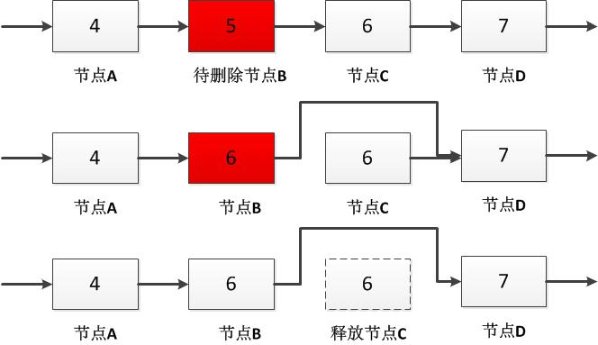

# 018_01-在O(1)时间删除链表结点

tags： 链表

---

## 题目原文

[牛客网链接_暂无]()
题目：给定单向链表的头指针和一个结点指针，定义一个函数在O(1)时间删除该结点。


## 解题思路

[参考](https://www.cnblogs.com/edisonchou/p/4765163.html)

### 常规思路

　在单向链表中删除一个结点，最常规的做法无疑是从链表的头结点开始，顺序遍历查找要删除的结点，并在链表中删除该结点。这种思路由于需要顺序查找，时间复杂度自然就是**O(n)**。


### 正确思路

是不是一定需要得到被删除的结点的前一个结点呢？答案是否定的。

　　我们可以很方便地得到要删除的结点的一下结点。因此，我们**可以把下一个结点的内容复制到需要删除的结点上覆盖原有的内容，再把下一个结点删除，就相当于把当前需要删除的结点删除了**。



　　但是，还有两个特殊情况需要进行考虑：

　　（1）如果要删除的结点位于链表的尾部，那么它就没有下一个结点：

　　此时我们仍然从链表的头结点开始，顺序遍历得到该结点的前序结点，并完成删除操作，这仍然属于O(n)时间的操作。

　　（2）如果链表中只有一个结点，而我们又要删除链表的头结点（也是尾结点）：

　　此时我们在删除结点之后，还需要把链表的头结点设置为NULL。

　　最后，通过综合最坏情况（尾节点需要顺序查找，1次）和最好情况（n-1次），因此平均时间复杂度为：


　　需要注意的是：**受到O(1)时间的限制，我们不得不把确保结点在链表中的责任推给了函数DeleteNode的调用者**。

## 编程知识

[C++ 里 delete 指针两次会怎么样？](https://www.zhihu.com/question/38998078#answer-41205877)

## 代码

### [c++代码](./src/cpp/018_01-在O(1)时间删除链表结点.cpp)

大体思路

```
待删指针不是尾指针：
      待删指针的值用待删指针的下一个指针的值覆盖
      删掉待删指针的下一个指针
待删指针是尾指针：
      待删指针同时是头指针：
            删掉头指针
     待删指针不是头指针
            找到待删指针的前一个指针
            删掉待删指针，前一个指针的next赋值为空
```


```c++
void DeleteNode(ListNode** pListHead, ListNode* pToBeDeleted)
{
    if(!pListHead || !pToBeDeleted)
        return;

    // 要删除的结点不是尾结点
    if(pToBeDeleted->m_pNext != nullptr)
    {
        ListNode* pNext = pToBeDeleted->m_pNext;
        pToBeDeleted->m_nValue = pNext->m_nValue;
        pToBeDeleted->m_pNext = pNext->m_pNext;
 
        delete pNext;
        pNext = nullptr;
    }
    // 链表只有一个结点，删除头结点（也是尾结点）
    else if(*pListHead == pToBeDeleted)
    {
        delete pToBeDeleted;
        pToBeDeleted = nullptr;
        *pListHead = nullptr;
    }
    // 链表中有多个结点，删除尾结点
    else
    {
        ListNode* pNode = *pListHead;
        while(pNode->m_pNext != pToBeDeleted)
        {
            pNode = pNode->m_pNext;            
        }
 
        pNode->m_pNext = nullptr;
        delete pToBeDeleted;
        pToBeDeleted = nullptr;
    }
}
```

### [python代码](./src/python/018_01-在O(1)时间删除链表结点.py)

```python

```
