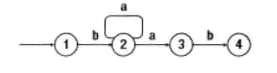

# 019-正则表达式匹配

tags：递归

---

## 题目原文

[牛客网链接](https://www.nowcoder.com/practice/623a5ac0ea5b4e5f95552655361ae0a8?tpId=13&tqId=11203&rp=2&ru=%2Fta%2Fcoding-interviews&qru=%2Fta%2Fcoding-interviews%2Fquestion-ranking&tPage=3)

> 请实现一个函数用来匹配包括'.'和'*'的正则表达式。模式中的字符'.'表示任意一个字符，而'*'表示它前面的字符可以出现任意次（包含0次）。 在本题中，匹配是指字符串的所有字符匹配整个模式。例如，字符串"aaa"与模式"a.a"和"ab*ac*a"匹配，但是与"aa.a"和"ab*a"均不匹配

**样例输入**

> "a","ab*a"

**样例输出**

> false

## 解题思路

[参考](https://github.com/Jack-Cherish/LeetCode)

这道题有些绕，需要好好思考下。

我们先来分析下如何匹配一个字符，现在只考虑字符'.'，不考虑'*'看一下：

如果字符串和模式串的当前字符相等，那么我们继续匹配它们的下一个字符；如果模式串中的字符是'.'，那么它可以匹配字符串中的任意字符，我们也可以继续匹配它们的下一个字符。

接下来，把字符'*'考虑进去，它可以匹配任意次的字符，当然出现0次也可以。

我们分两种情况来看：

- 模式串的下一个字符不是'*'，也就是上面说的只有字符'.'的情况。

如果字符串中的第一个字符和模式串中的第一个字符相匹配，那么字符串的模式串都向后移动一个字符，然后匹配剩余的字符串和模式串。如果字符串中的第一个字符和模式中的第一个字符不相匹配，则直接返回false。

- 模式串的下一个字符是'*'，此时就要复杂一些。

因为可能有多种不同的匹配方式。

选择一：无论字符串和模式串当前字符相不相等，我们都将模式串后移两个字符，相当于把模式串中的当前字符和'*'忽略掉，因为'*'可以匹配任意次的字符，所以出现0次也可以。

选择二：如果字符串和模式串当前字符相等，则字符串向后移动一个字符。而模式串此时有两个选择：

1、我们可以在模式串向后移动两个字符，继续匹配；

2、也可以保持模式串不变，这样相当于用字符'*'继续匹配字符串，也就是模式串中的字符'*'匹配字符串中的字符多个的情况。

用一张图表示如下：

[](https://cuijiahua.com/wp-content/uploads/2018/01/basis_52_1.png)

如上图所示，当匹配进入状态2，并且字符串中的字符是'a'时，我们有两个选择：可以进入状态3（在模式串向后移动两个字符），也可以回到状态2（模式串保持不变）。

除此之外，还要注意对空指针的处理。

#### 代码思路

1. 两个字符串都为空，返回true
2. 当第一个字符串不空，而第二个字符串空了，返回false（因为这样，就无法匹配成功了,而如果第一个字符串空了，第二个字符串非空，还是可能匹配成功的，比如第二个字符串是“a*a*a*a*”,由于‘*’之前的元素可以出现0次，所以有可能匹配成功）
3. 开始匹配第一个字符，这里有两种可能：匹配成功或匹配失败。但考虑到pattern下一个字符可能是‘*’， 这里我们分两种情况讨论：pattern下一个字符为‘*’或不为‘*’：

3.1 pattern下一个字符为‘*’时，稍微复杂一些，因为‘*’可以代表0个或多个。这里把这些情况都考虑到：

(a)  a>当‘*’匹配0个字符时，str当前字符不变，pattern当前字符后移两位，跳过这个‘*’符号；

(b) >当‘*’匹配1个或多个时，str当前字符移向下一个，pattern当前字符不变; 或者str+1,pattern+2;或者str不变, patter+2;

3.2 pattern下一个字符不为‘*’：这种情况比较简单，直接匹配当前字符。如果匹配成功，继续匹配下一个；如果匹配失败，直接返回false。注意这里的 “匹配成功”，除了两个字符相同的情况外，还有一种情况，就是pattern的当前字符为‘.’,同时str的当前字符不为‘\0’。

## 代码

### [c++代码](./src/cpp/019-正则表达式匹配.cpp)

```c++


class Solution {
public:
    bool match(char* str, char* pattern)
    {
        if(str==nullptr||pattern==nullptr)
            return false;
        else
            return matchCore(str,pattern);
    }
    
    bool matchCore(char* str, char* pattern){
        if(*str=='\0'&&*pattern=='\0')
            return true;
        if(*str!='\0'&&*pattern=='\0')
            return false;
        if(*(pattern+1)=='*'){
            if(*str==*pattern||(*pattern=='.'&&*str!='\0'))
                return matchCore(str+1,pattern+2)||matchCore(str+1,pattern)||matchCore(str,pattern+2);
            else
                return matchCore(str,pattern+2);
        }
        if(*str==*pattern||(*pattern=='.'&&*str!='\0')){
            return matchCore(str+1,pattern+1);
        }
        
        return false;
    }
};
```

### [python代码](./src/python/019-正则表达式匹配.py)

```python

```

