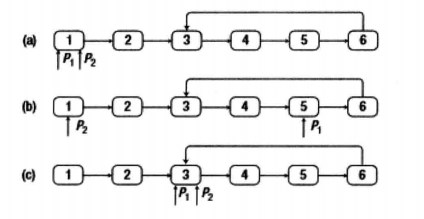
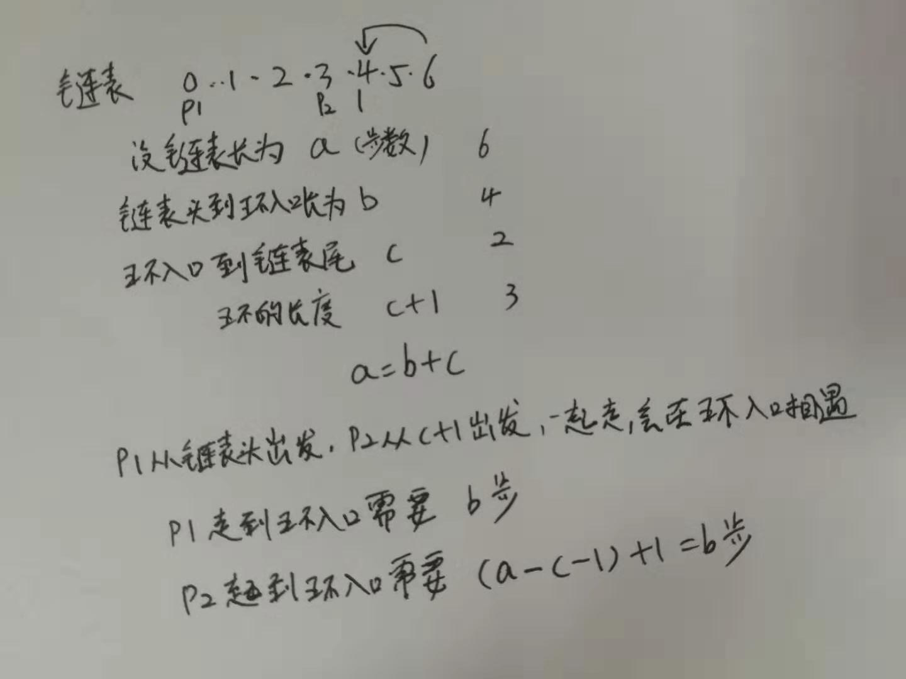

# 023-链表中环的入口结点

tags： 两指针

---

## 题目原文

[牛客网链接](https://www.nowcoder.com/practice/253d2c59ec3e4bc68da16833f79a38e4?tpId=13&tqId=11208&tPage=3&rp=1&ru=%2Fta%2Fcoding-interviews&qru=%2Fta%2Fcoding-interviews%2Fquestion-ranking)

给一个链表，若其中包含环，请找出该链表的环的入口结点，否则，输出null。

## 解题思路

### 剑指offer

假设链表长度为N, 那么第N链接到了第k个节点形成了环，即我们需要查找到倒数第N-K+1个节点, 那么环中就有N-K+1个节点，这时候我们定义两个指针$P_1$和$P_2$指向链表的头部, 指针$P_1$先在链表中向前移动n-k+1步,到达第n-k+2个节点, 然后两个指针同步向前移动, 当$P_2$走了K-1步到达环的入口的时候, 指针$P_1$正好走了N+1步, 到达了环的入口, 即两个指针会相遇在环的入口处

以下图为例，指针P1和P2在初始化时都指向链表的头结点。由于环中有4个结点，指针P1先在链表上向前移动4步。接下来两个指针以相同的速度在链表上向前移动，直到它们相遇。它们相遇的结点正好是环的入口结点。



那么我们剩下的问题就是如何得到环中节点的数目?

我们可以使用一快一慢两个指针（比如慢指针一次走一步，　慢指针一次走两步），如果走的过程中发现快指针追上了慢指针, 说明遇见了环，而且相遇的位置一定在环内, 考虑一下环内, 从任何一个节点出现再回到这个节点的距离就是环的长度, 于是我们可以进一步移动慢指针，快指针原地不动, 当慢指针再次回到相遇位置时, 正好在环内走了一圈, 从而我们通过计数就可以获取到环的长度

- 第一步，找环中相汇点。分别用p1，p2指向链表头部，p1每次走一步，p2每次走二步，直到p1==p2找到在环中的相汇点。
- 第二步，找环的长度。从环中的相汇点开始, p2不动, p1前移，　当再次相遇时，p1刚好绕环一周, 其移动即为环的长度K
- 第三步, 求换的起点, 转换为求环的倒数第N-K个节点，则两指针left和right均指向起始, right先走K步, 然后两个指针开始同步移动, 当两个指针再次相遇时, right刚好绕环一周回到起点, left则刚好走到了起点位置



```c++
/*
struct ListNode {
    int val;
    struct ListNode *next;
    ListNode(int x) :
        val(x), next(NULL) {
    }
};
*/
class Solution {
public:
    ListNode* EntryNodeOfLoop(ListNode* pHead)
    {
        if(pHead==nullptr)
            return nullptr;
        ListNode* meetingNode=FindMeetingNode(pHead);
        if(meetingNode==nullptr)
            return nullptr;
        ListNode* p1=meetingNode->next;
        int num=1;
        while(p1!=meetingNode){
            p1=p1->next;
            num++;
        }
        
        ListNode* p2=pHead;
        
        while(num>0){
            p2=p2->next;
            num--;
        }
        
        p1=pHead;
        
        while(p1!=p2){
            p1=p1->next;
            p2=p2->next;
        }
        
        return p1;
    }
    
    ListNode* FindMeetingNode(ListNode* pHead){
        if(pHead==nullptr||pHead->next==nullptr)
            return nullptr;
        ListNode* slow=pHead;
        ListNode* fast=slow->next;
        
        while(slow!=nullptr&&fast!=nullptr){
            if(slow==fast)
                return slow;
            slow=slow->next;
            fast=fast->next;
            if(fast!=nullptr)
                fast=fast->next;
        }
        return nullptr;
    }
};
```

### 稍微简单一些的办法

[参考](https://www.acwing.com/solution/acwing/content/741/)

[参考](https://www.e-learn.cn/content/qita/780537)

两个结论：

​        **1、设置快慢指针，假如有环，他们最后一定相遇。**

​        **2、两个指针分别从链表头和相遇点继续出发，每次走一步，最后一定相遇与环入口。**

​        **证明1**：设置快慢指针fast和low，fast每次走两步，low每次走一步。假如有环，两者一定会相遇（因为low一旦进环，可看作fast在后面追赶low的过程，每次两者都接近一步，最后一定能追上）。

​        **证明2：**

​        设：

​        链表头到环入口长度为--**a**

​        环入口到相遇点长度为--**b**

​        相遇点到环入口长度为--**c**


则：相遇时

​        **快指针路程=a+(b+c)k+b** ，k>=1  其中b+c为环的长度，k为绕环的圈数（k>=1,即最少一圈，不能是0圈，不然和慢指针走的一样长，矛盾）。

​        **慢指针路程=a+b**

​        快指针走的路程是慢指针的两倍，所以：

​        **（a+b）\*2=a+(b+c)k+b**

​        化简可得：

​        **a=(k-1)(b+c)+c**     这个式子的意思是：    **链表头到环入口的距离=相遇点到环入口的距离+（k-1）圈环长度**。其中k>=1,所以**k-1>=0**圈。所以两个指针分别从链表头和相遇点出发，最后一定相遇于环入口。

```c++
/**
 * Definition for singly-linked list.
 * struct ListNode {
 *     int val;
 *     ListNode *next;
 *     ListNode(int x) : val(x), next(NULL) {}
 * };
 */
class Solution {
public:
    ListNode *entryNodeOfLoop(ListNode *head) {
        if (!head || !head->next) return 0;
        ListNode *first = head, *second = head;

        while (first && second)
        {
            first = first->next;
            second = second->next;
            if (second) second = second->next;
            else return 0;

            if (first == second)
            {
                first = head;
                while (first != second)
                {
                    first = first->next;
                    second = second->next;
                }
                return first;
            }
        }

        return 0;
    }
};

```

### 断链法

[参考]([https://github.com/gatieme/CodingInterviews/tree/master/056-%E9%93%BE%E8%A1%A8%E4%B8%AD%E7%8E%AF%E7%9A%84%E5%85%A5%E5%8F%A3%E7%BB%93%E7%82%B9](https://github.com/gatieme/CodingInterviews/tree/master/056-链表中环的入口结点))

时间复杂度为O（n），两个指针，一个在前面，另一个紧邻着这个指针，在后面。 两个指针同时向前移动，每移动一次，前面的指针的next指向NULL。 也就是说：访问过的节点都断开，最后到达的那个节点一定是尾节点的下一个， 也就是循环的第一个。 这时候已经是第二次访问循环的第一节点了，第一次访问的时候我们已经让它指向了NULL， 所以到这结束。

但是这种方法修改了链表的指向

```c++
class Solution
{
public:
    ListNode* EntryNodeOfLoop(ListNode* pHead)
    {
        if (pHead == NULL
         || pHead->next == NULL)
        {
            return NULL;
        }

        ListNode* previous = pHead;
        ListNode* current = pHead->next;
        while (current != NULL)
        {
            previous->next = NULL;
            previous = current;
            current = current->next;
        }

        return previous;
    }
};
```


## 代码

### [c++代码](./src/cpp/023-链表中环的入口结点.cpp)

```c++
/*
struct ListNode {
    int val;
    struct ListNode *next;
    ListNode(int x) :
        val(x), next(NULL) {
    }
};
*/
class Solution {
public:
    ListNode* EntryNodeOfLoop(ListNode* pHead)
    {
        if(pHead==nullptr)
            return nullptr;
        ListNode* meetingNode=FindMeetingNode(pHead);
        if(meetingNode==nullptr)
            return nullptr;
        ListNode* p1=meetingNode->next;
        int num=1;
        while(p1!=meetingNode){
            p1=p1->next;
            num++;
        }
        
        ListNode* p2=pHead;
        
        while(num>0){
            p2=p2->next;
            num--;
        }
        
        p1=pHead;
        
        while(p1!=p2){
            p1=p1->next;
            p2=p2->next;
        }
        
        return p1;
    }
    
    ListNode* FindMeetingNode(ListNode* pHead){
        if(pHead==nullptr||pHead->next==nullptr)
            return nullptr;
        ListNode* slow=pHead;
        ListNode* fast=slow->next;
        
        while(slow!=nullptr&&fast!=nullptr){
            if(slow==fast)
                return slow;
            slow=slow->next;
            fast=fast->next;
            if(fast!=nullptr)
                fast=fast->next;
        }
        return nullptr;
    }
};
```

### [python代码](./src/python/023-链表中环的入口结点.py)

```python

```

