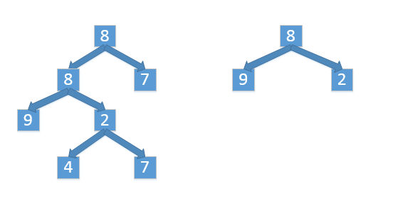

# 026-树的子结构

tags： 二叉树 递归

---

## 题目原文

[牛客网链接](https://www.nowcoder.com/practice/6e196c44c7004d15b1610b9afca8bd88?tpId=13&tqId=11170&tPage=1&rp=1&ru=%2Fta%2Fcoding-interviews&qru=%2Fta%2Fcoding-interviews%2Fquestion-ranking)

**题目：**输入两棵二叉树A和B，判断B是不是A的子结构。例如下图中的两棵二叉树，由于A中有一部分子树的结构和B是一样的，因此B是A的子结构。


## 解题思路

　[参考](https://www.cnblogs.com/lfeng1205/p/6826026.html)

要查找树A是否存在和树B结构一样的子树，我们可以分成两步：第一步在树A中找到和树B的根节点的值一样的节点R,第二步再判断树A中以R为根节点的子树是不是包含和树B一样的结构。



 

　　如上图所示：首先我们试着在树A中找到值为8(树B的根节点的值)的节点。从树A的根节点开始遍历，我们发现它的根节点就是8。接着我们就去判断树A的根节点下面的子树是不是含有和树B一样的结构。在树A中，根节点的左子节点的值是8，而树B的根节点的左子节点是9，对应的两个节点不同。

　　因此，我们仍需要遍历树A，接着查找值为8的节点。我们在树的第二层找到了一个值为8的节点，然后进行第二步判断，即判断这个节点下面的子树是否含有和树B一样结构的子树。于是我们遍历这个节点下面的子树，先后得到两个子节点9和2，这和B树的结构完全相同。此时我们在树A中找到了一个和树B的结构一样的子树，因此树B是树A的子结构。

　　第一步在树A中查找与根节点一样的节点，实际上就是树的遍历，可以采用递归的方式，代码如下：

```c++
    bool HasSubtree(TreeNode* pRoot1, TreeNode* pRoot2)
    {
        bool res=false;
        if(pRoot1!=nullptr&&pRoot2!=nullptr){
            if(pRoot1->val==pRoot2->val)
                res=doesTree1HasTree2(pRoot1,pRoot2);
            if(!res)
                res=doesTree1HasTree2(pRoot1->left,pRoot2);
            if(!res)
                res=doesTree1HasTree2(pRoot1->right,pRoot2);
        }
        return res;
    }
```

第二步是判断树A中以R为根节点的子树是不是和树B具有相同的结构。同样，我们也可以用递归的思路来考虑：如果节点R的值和树B的根节点不相同，则以R为根节点的子树和树B肯定不具有相同的结点；如果它们的值相同，则递归地判断它们各自的左右节点的值是不是相同。递归的终止条件是我们到达了树Ａ或者树B的叶节点，代码如下：


  ```c++
    bool doesTree1HasTree2(TreeNode* pRoot1, TreeNode* pRoot2){
        if (pRoot2==nullptr)
            return true;
        if (pRoot1==nullptr)
            return false;
        if(pRoot1->val!=pRoot2->val)
            return false;
        return doesTree1HasTree2(pRoot1->left,pRoot2->left)&&doesTree1HasTree2(pRoot1->right,pRoot2->right);
  ```

上述代码有多处判断节点是不是NULL，这样做是为了避免试图访问空节点而造成的程序崩溃，同时设置了递归调用的退出条件。

## 代码

### [c++代码](./src/cpp/026-树的子结构.cpp)

```c++
/*
struct TreeNode {
	int val;
	struct TreeNode *left;
	struct TreeNode *right;
	TreeNode(int x) :
			val(x), left(NULL), right(NULL) {
	}
};*/
class Solution {
public:
    bool HasSubtree(TreeNode* pRoot1, TreeNode* pRoot2)
    {
        bool res=false;
        if(pRoot1!=nullptr&&pRoot2!=nullptr){
            if(pRoot1->val==pRoot2->val)
                res=doesTree1HasTree2(pRoot1,pRoot2);
            if(!res)
                res=doesTree1HasTree2(pRoot1->left,pRoot2);
            if(!res)
                res=doesTree1HasTree2(pRoot1->right,pRoot2);
        }
        return res;
    }
    
    bool doesTree1HasTree2(TreeNode* pRoot1, TreeNode* pRoot2){
        if (pRoot2==nullptr)
            return true;
        if (pRoot1==nullptr)
            return false;
        if(pRoot1->val!=pRoot2->val)
            return false;
        return doesTree1HasTree2(pRoot1->left,pRoot2->left)&&doesTree1HasTree2(pRoot1->right,pRoot2->right);
    }
};
```

### [python代码](./src/python/026-树的子结构.py)

```python

```

## 二叉树的子树和子结构

[参考](https://blog.csdn.net/wushuomin/article/details/79943737)

> 子树的意思是只要包含了一个结点，就得包含这个结点下的所有节点. 
> 子结构的意思是包含了一个结点，可以只取左子树或者右子树，或者都不取。

简单而言，与子树不同的是，子结构可以是A树的任意一部分。 
这里以一颗7节点，高度为3的满二叉树为例，说明子树和子结构的差别： 


**1.图1的子树示意图**
对于图1而言，子树意味着图2，图3等情况。根据定义非常好理解。 


图2 图1子树的某一种情况 


图3 图1子树的某一种情况


**2.图1的子结构示意图**
由于子结构可以是原树的任意一个部分，因此图3就是一个子结构。 


图4 图1的子结构示意图

### 求子树的代码

```c++
//函数声明，这里是为了先看首先要调用的函数，才放到后面去的。
    bool isSubtree(TreeNode* pRoot1, TreeNode* pRoot2);
    //正式开始第一个函数
    bool HasSubtree(TreeNode* pRoot1, TreeNode* pRoot2)
    {
        //因为定义空树不是任何一个树的子树，因此如果有个根节点是空树，那么直接返回false
        if(pRoot1 == NULL || pRoot2 == NULL)    
            return false;
        bool result = false;
        //如果当前两个树节点值相同，就调用其他函数判断能否以当前节点为根节点下找到相同的子树。
        if(pRoot1->val == pRoot2->val)
        {
            result = isSubtree(pRoot1, pRoot2);
        }
        //如果不同或者是以当前节点为根节点下找不到相同的子树，那么就看看A树的左节点或者右节点中有没有。
        if(!result)
            result = HasSubtree(pRoot1->left, pRoot2);
        if(!result)
            result = HasSubtree(pRoot1->right, pRoot2);
        return result;

    }
    bool isSubtree(TreeNode* pRoot1, TreeNode* pRoot2)
    {
        //因为是子树：只要包含了一个结点，就得包含这个结点下的所有节点。
        //因此，A树与其子树一定最后同时访问到空指针。
        if(pRoot2 == NULL && pRoot1 == NULL)
            return true;
        else if(pRoot2 != NULL && pRoot1 != NULL)
        {
            if(pRoot1->val != pRoot2->val)
            {
                return false;
            }
            return isSubtree(pRoot1->left, pRoot2->left) && isSubtree(pRoot1->right, pRoot2->right);
        }
        else
            return false;
    }
```

### 求二叉树A子结构的代码
根据定义，可以知道子树是子结构中的一种特殊情况，因此两段代码之间有很大的相似之处。 
不同之处在于： 
1. 子树只要包含了一个结点，就得包含这个结点下的所有节点。因此，A树与其子树一定最后同时访问到空指针。 
2. 子结构只要包含任意相连的任意数量的结点即可。

因此，对于子结构而言，只要在子结构访问到空指针之前，所有的节点均和A树的某部分相同就可以了。

```c++
//函数声明，这里是为了先看首先要调用的函数，才放到后面去的。
    bool isSubtree(TreeNode* pRoot1, TreeNode* pRoot2);
    //正式开始第一个函数
    bool HasSubtree(TreeNode* pRoot1, TreeNode* pRoot2)
    {
        //因为定义空树不是任何一个树的子树，因此如果有个根节点是空树，那么直接返回false
        if(pRoot1 == NULL || pRoot2 == NULL)    
            return false;
        bool result = false;
        //如果当前两个树节点值相同，就调用其他函数判断能否以当前节点为根节点下找到相同的子树。
        if(pRoot1->val == pRoot2->val)
        {
            result = isSubtree(pRoot1, pRoot2);
        }
        //如果不同或者是以当前节点为根节点下找不到相同的子树，那么就看看A树的左节点或者右节点中有没有。
        if(!result)
            result = HasSubtree(pRoot1->left, pRoot2);
        if(!result)
            result = HasSubtree(pRoot1->right, pRoot2);
        return result;

    }
    bool isSubtree(TreeNode* pRoot1, TreeNode* pRoot2)
    {
        //这里不一样！！！！
        //这里不一样！！！！
        //这里不一样！！！！
        //子结构访问到空指针时，和A树的比较都一直是true就是true.
        //而这个函数能一直循环下去，就意味着之前的比较都是true,因此，这里程序改为
        if(pRoot2 == NULL)
            return true;
        else if(pRoot1 == NULL)  
            return false; 
        else if(pRoot2 != NULL && pRoot1 != NULL)
        {
            if(pRoot1->val != pRoot2->val)
            {
                return false;
            }
            return isSubtree(pRoot1->left, pRoot2->left) && isSubtree(pRoot1->right, pRoot2->right);
        }
        else
            return false;
    }
```


