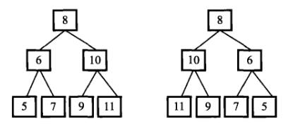

# 027-二叉树的镜像

tags： 二叉树 遍历 递归

---

## 题目原文

[牛客网链接](https://www.nowcoder.com/practice/564f4c26aa584921bc75623e48ca3011?tpId=13&tqId=11171&tPage=1&rp=1&ru=%2Fta%2Fcoding-interviews&qru=%2Fta%2Fcoding-interviews%2Fquestion-ranking)

操作给定的二叉[树](https://cuijiahua.com/blog/tag/树/)，将其变换为源二叉树的镜像。

如下图所示：



## 解题思路

[参考]([https://github.com/gatieme/CodingInterviews/tree/master/019-%E4%BA%8C%E5%8F%89%E6%A0%91%E7%9A%84%E9%95%9C%E5%83%8F](https://github.com/gatieme/CodingInterviews/tree/master/019-二叉树的镜像))

二叉树的镜像结果, 中间像放置了一面镜子，将源二叉树投射在镜子中

通常的思路，我们创建一个树以后，交换没个节点的左右孩子就行了。

因此我们只需要遍历二叉树，然后每次访问（输出）一个节点的时候。交换其左右孩子即可

于是我们实现了下面的递归，非递归的函数版本，其本质是相同的，就是把前序中序，后序遍历中的打印节点的过程，变成交换左右子树的过程，其中需要注意一点，就是交换后左右子树进行了交换，再往下走的时候，往左走往右走的过程需改变，原来的向右走，现在应该是向左走

### 递归方法

采用递归思路，层层交换节点的左右孩子指针。

```c++
/*
struct TreeNode {
	int val;
	struct TreeNode *left;
	struct TreeNode *right;
	TreeNode(int x) :
			val(x), left(NULL), right(NULL) {
	}
};*/
class Solution {
public:
    void Mirror(TreeNode *pRoot) {
        if (pRoot==nullptr)
            return;
        if(pRoot->left==nullptr&&pRoot->right==nullptr)
            return;
        TreeNode* temp=pRoot->left;
        pRoot->left=pRoot->right;
        pRoot->right=temp;
        if(pRoot->left!=nullptr)
            Mirror(pRoot->left);
        if(pRoot->right!=nullptr)
            Mirror(pRoot->right);
    }
};
```

### 非递归方法

#### 前序遍历

前序遍历的过程中，先根，再左再右，

由于根后面才对左右子树进行访问，因此访问顺序可不交换，我们此时的访问顺序依旧是根左右，但是对应原来的根右左

```c++
class Solution
{
public:
    void MirrorPre(TreeNode *root)
    {
        if(root == NULL)
        {
            return ;
        }

        stack<TreeNode *> nstack;
        TreeNode *node = root;

        while(node != NULL
           || nstack.empty( ) != true)
        {
            while(node != NULL)
            {
                if(node->left != NULL || node->right != NULL)
                {
                    swap(node->left, node->right);
                }

                nstack.push(node);
                node = node->left;
            }

            if(nstack.empty( ) != true)
            {
                node = nstack.top( );
                nstack.pop( );
                node = node->right;
            }
        }
    }

    void MirrorPreBFS(TreeNode *root)
    {
        if(root == NULL)
        {
            return;
        }
        stack<TreeNode *> nstack;
        nstack.push(root);

        TreeNode *node = root;
        while(nstack.empty() != true)
        {
            node = nstack.top( );
            nstack.pop( );

            //  先交换, 然后递归左，接着递归右
            //  相当与一次前序遍历
            if(node->left != NULL || node->right != NULL)
            {
                swap(node->left, node->right);
            }

            if(node->left != NULL)
            {
                nstack.push(node->left);
            }
            if(node->right != NULL)
            {
                nstack.push(node->right);
            }
        }
    }

};
```

#### 中序遍历

中序遍历的时候，访问顺序左根右，由于访问后，依然要向右走，

所以交换后，变成了向左走

```c++
class Solution
{
public:
    void MirrorIn(TreeNode *root)
    {
        if(root == NULL)
        {
            debug <<"The tree is NULL..." <<endl;
            return NULL;
        }

        stack<TreeNode *> nstack;
        TreeNode *node = root;

        //  开始遍历整个二叉树
        while(node != NULL || nstack.empty() != true)
        {
            // 不输出当前根节点，但是递归直至当前根节点node的最左端
            while(node != NULL)
            {
                nstack.push(node);
                node = node->left;
            }

            //  此时栈顶的元素是当前最左元素
            //  它应该被输出
            if(nstack.empty( ) != true)
            {
                node = nstack.top( );

                //  将原来的输出改为交换左右子树即可
                if(node->left != NULL || node->right != NULL)
                {
                    swap(node->left, node->right);
                }

                nstack.pop( );
                //  中序遍历输出根后，向右转向
                //  此时由于左右子树交换，因此原来的右子树是其左子树，向左转向
                node = node->left;
            }
        }
    }

};
```

#### 后序遍历

跟先序访问一样，访问了左右才会访问根，访问顺序变了

```c++
class Solution
{
public:
    void MirrorPost(TreeNode *root)
    {

        if(root == NULL)
        {
            debug <<"The tree is NULL..." <<endl;
            return;
        }
        stack<TreeNode *> nstack;

        TreeNode *cur;                      //当前结点
        TreeNode *pre = NULL;                 //前一次访问的结点
        nstack.push(root);

        while(nstack.empty( ) != true)
        {
            cur = nstack.top( );

            if((cur->left == NULL && cur->right == NULL)                     //  左右还是均为NULL, 可以被输出
            || (pre != NULL && ((pre == cur->left /*&& cur->right == NULL*/) || pre == cur->right)))     //  左右还是被输出了, 递归返回

            {
                ///cout<<cur->val;  //如果当前结点没有孩子结点或者孩子节点都已被访问过
                            //  将原来的输出改为交换左右子树即可
                if(cur->left != NULL || cur->right != NULL)
                {
                    swap(cur->left, cur->right);
                }

                nstack.pop( );
                pre = cur;
            }
            else
            {
                // 由于栈是先进后出，因此先如后孩子, 再左孩子可以保证递归返回时先遍历左孩子
                if(cur->right != NULL)
                {
                    nstack.push(cur->right);
                }

                if(cur->left != NULL)
                {
                    nstack.push(cur->left);
                }
            }
        }
    }


};
```


## 代码

### [c++代码](./src/cpp/027-二叉树的镜像.cpp)

```c++
/*
struct TreeNode {
	int val;
	struct TreeNode *left;
	struct TreeNode *right;
	TreeNode(int x) :
			val(x), left(NULL), right(NULL) {
	}
};*/
class Solution {
public:
    void Mirror(TreeNode *pRoot) {
        if (pRoot==nullptr)
            return;
        if(pRoot->left==nullptr&&pRoot->right==nullptr)
            return;
        TreeNode* temp=pRoot->left;
        pRoot->left=pRoot->right;
        pRoot->right=temp;
        if(pRoot->left!=nullptr)
            Mirror(pRoot->left);
        if(pRoot->right!=nullptr)
            Mirror(pRoot->right);
    }
};
```

### [python代码](./src/python/027-二叉树的镜像.py)

```python

```
