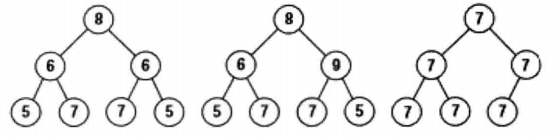

# 028-对称的二叉树

tags： 二叉树 遍历

---

## 题目原文

[牛客网链接]()

请实现一个函数，用来判断一颗[二叉树](https://cuijiahua.com/blog/tag/二叉树/)是不是对称的。注意，如果一个二叉树同此二叉树的镜像是同样的，定义其为对称的。

## 解题思路

[参考](https://cuijiahua.com/blog/2018/01/basis_58.html)



我们通常有三种不同的二叉树遍历算法，即前序遍历、中序遍历和后序遍历。在这三种遍历算法中，都是先遍历左子结点再遍历右子结点。以前序遍历为例，我们可以定义一个遍历算法，先遍历右子结点再遍历左子结点，暂且称其为前序遍历的对称遍历。

遍历第一棵树，前序遍历的遍历序列为{8,6,5,7,6,7,5}，其对称遍历的遍历序列为{8,6,5,7,6,7,5}。

遍历第二颗树，前序遍历的遍历序列为{8,6,5,7,9,7,5}，其对称遍历的遍历序列为{8,9,5,7,6,7,5}。

可以看到，使用此方法可以区分前两棵树，第一棵树为对称树，第二颗树不是对称树。但是当使用此方法，你会发现第三颗树的前序遍历和对称前序遍历的遍历序列是一样的。

怎么区分第三颗树呢？解决办法就是我们也要考虑NULL指针。此时，前序遍历的遍历序列{7,7,7,NULL,NULL,7,NULL,NULL,7,7,NLL,NULL,NULL}, 序列前三个7对应从根节点开始沿着指向左子节点的指针遍历经过的三个节点, 接下来两个NULL指针对应的是第三层第一个节点的两个子节点, 其他的节点直接分析.其对称遍历的遍历序列为{7,7,NULL,7,NULL,NULL,7,7,NULL,NULL,7,NULL,NULL}。因为两种遍历的序列不同，因此这棵树不是对称树。

### 难点

这道题比较难想到第三个二叉树的情况以及解决办法

## 代码

### [c++代码](./src/cpp/028-对称的二叉树.cpp)

```c++
/*
struct TreeNode {
    int val;
    struct TreeNode *left;
    struct TreeNode *right;
    TreeNode(int x) :
            val(x), left(NULL), right(NULL) {
    }
};
*/
class Solution {
public:
    bool isSymmetrical(TreeNode* pRoot)
    {
        return isSymmetricalCore(pRoot,pRoot);
    }
    
    bool isSymmetricalCore(TreeNode* pRoot1,TreeNode* pRoot2){
        if(pRoot1==nullptr&&pRoot2==nullptr)
            return true;
        if(pRoot1==nullptr||pRoot2==nullptr)
            return false;
        if(pRoot1->val!=pRoot2->val)
            return false;
        return isSymmetricalCore(pRoot1->left,pRoot2->right)&&isSymmetricalCore(pRoot1->right,pRoot2->left);
    }

};
```

### [python代码](./src/python/028-对称的二叉树.py)

```python

```
