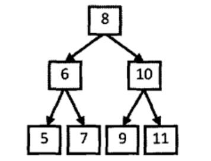
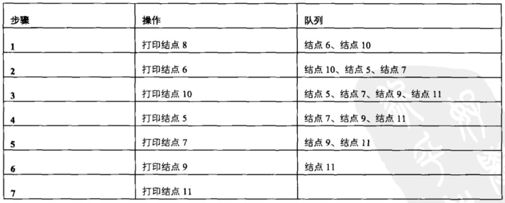

# 032_01-从上往下打印二叉树

tags： 层次遍历 二叉树

---

## 题目原文

[牛客网链接](https://www.nowcoder.com/practice/7fe2212963db4790b57431d9ed259701?tpId=13&tqId=11175&tPage=2&rp=1&ru=%2Fta%2Fcoding-interviews&qru=%2Fta%2Fcoding-interviews%2Fquestion-ranking)

从上往下打印出二叉树的每个节点，同层节点从左至右打印。

## 解题思路

　这道题实质是考查树的**层次遍历（广度优先遍历）**算法：

每一次打印一个结点的时候，如果该结点有子结点，则把该结点的子结点放到一个队列的末尾。接下来到队列的头部取出最早进入队列的结点，重复前面的打印操作，直至队列中所有的结点都被打印出来为止。

举例说明：



如上图所示，因为按层打印的顺序决定应该先打印根结点，所以我们从树的根结点开始分析。为了接下来能够打印值为8的结点的两个子结点，我们应该在遍历该结点时把值为6和10的两个结点保存到一个容器里，现在容器内就有两个结点了。按照从左到右打印的要求，我们先取出为6的结点。打印出值6之后把它的值分别为5和7的两个结点放入数据容器。此时数据容器中有三个结点，值分别为10、5和7。接下来我们从数据容器中取出值为10的结点。注意到值为10的结点比值为5、7的结点先放入容器，此时又比这两个结点先取出，这就是我们通常说的先入先出，因此不难看出这个数据容器应该是一个队列。由于值为5、7、9、11的结点都没有子结点，因此只要依次打印即可。

整个打印过程如下图所示：



通过上面具体例子的分析，我们可以找到从上到下打印二叉树的规律：每一次打印一个结点的时候，如果该结点有子结点，则把该结点的子结点放到一个队列的末尾。接下来到队列的头部取出最早进入队列的结点，重复前面的打印操作，直至队列中所有的结点都打印出来为止。

## 代码

### [c++代码](./src/cpp/032_01-从上往下打印二叉树.cpp)

```c++
/*
struct TreeNode {
	int val;
	struct TreeNode *left;
	struct TreeNode *right;
	TreeNode(int x) :
			val(x), left(NULL), right(NULL) {
	}
};*/
class Solution {
public:
    vector<int> PrintFromTopToBottom(TreeNode* root) {
        vector<int> res;
        if(root==nullptr)
            return res;
        queue<TreeNode*> nodeQueue;
        nodeQueue.push(root);
        while(!nodeQueue.empty()){
            TreeNode* node=nodeQueue.front();
            nodeQueue.pop();
            res.push_back(node->val);
            if(node->left!=nullptr)
                nodeQueue.push(node->left);
            if(node->right!=nullptr)
                nodeQueue.push(node->right);
        }
        return res;
    }
};
```

### [python代码](./src/python/032_01-从上往下打印二叉树.py)

```python

```

## 举一反三


