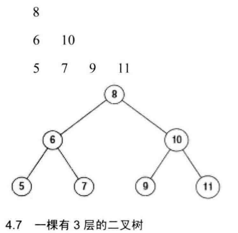

# 032_02-把二叉树打印成多行

tags： 层次遍历 二叉树

---

## 题目原文

[牛客网链接](https://www.nowcoder.com/practice/445c44d982d04483b04a54f298796288?tpId=13&tqId=11213&tPage=3&rp=1&ru=%2Fta%2Fcoding-interviews&qru=%2Fta%2Fcoding-interviews%2Fquestion-ranking)

从上到下按层打印二叉树, 同一层的节点按从左到右的顺序打印, 每一层打印到一行, 例如, 下图中二叉树的打印结果为



## 解题思路


## 代码

### [c++代码](./src/cpp/032_02-把二叉树打印成多行.cpp)

```c++
/*
struct TreeNode {
    int val;
    struct TreeNode *left;
    struct TreeNode *right;
    TreeNode(int x) :
            val(x), left(NULL), right(NULL) {
    }
};
*/
class Solution {
public:
        vector<vector<int> > Print(TreeNode* pRoot) {
            vector<vector<int>> res;
            if(pRoot==nullptr)
                return res;
            int currentLevelNum=1;
            int nextLevelNum=0;
            queue<TreeNode*> nodeQueue;
            nodeQueue.push(pRoot);
            vector<int> level;
            while(!nodeQueue.empty()){
                TreeNode* node=nodeQueue.front();
                nodeQueue.pop();
                currentLevelNum--;
                level.push_back(node->val);
                
                if(node->left!=nullptr){
                    nodeQueue.push(node->left);
                    nextLevelNum++;
                }
                
                if(node->right!=nullptr){
                    nodeQueue.push(node->right);
                    nextLevelNum++;
                }
                
                if(currentLevelNum==0){
                    res.push_back(level);
                    vector<int>().swap(level);
                    currentLevelNum=nextLevelNum;
                    nextLevelNum=0;
                }
            }
            
            return res;
        }
    
};
```

### [python代码](./src/python/032_02-把二叉树打印成多行.py)

```python

```
