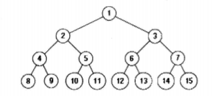
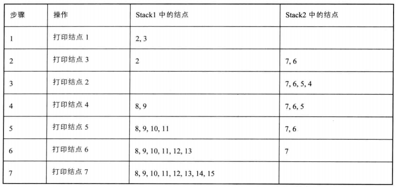

# 032_03-按之字形顺序打印二叉树

tags： 层次遍历 二叉树

---

## 题目原文

[牛客网链接](https://www.nowcoder.com/practice/91b69814117f4e8097390d107d2efbe0?tpId=13&tqId=11212&tPage=3&rp=1&ru=%2Fta%2Fcoding-interviews&qru=%2Fta%2Fcoding-interviews%2Fquestion-ranking)

请实现一个函数按照之字形打印二叉树，即第一行按照从左到右的顺序打印，第二层按照从右至左的顺序打印，第三行按照从左到右的顺序打印，其他行以此类推。




按之字顺序打印上图二叉树，打印顺序为：

1

3 2

4 5 6 7

15 14 13 12 12 10 9 8

## 解题思路

[参考](https://cuijiahua.com/blog/2018/01/basis_59.html)

为了达到这样打印的效果，我们需要使用两个栈。我们在打印某一行结点时，把下一层的子结点保存到相应的栈里。如果当前打印的是奇数层（第一层、第三层等），则先保存左子树结点再保存右子树结点到第一个栈里。如果当前打印的是偶数层（第二层、第四层等），则则先保存右子树结点再保存左子树结点到第二个栈里。



## 代码

### [c++代码](./src/cpp/032_03-按之字形顺序打印二叉树.cpp)

```c++
/*
struct TreeNode {
    int val;
    struct TreeNode *left;
    struct TreeNode *right;
    TreeNode(int x) :
            val(x), left(NULL), right(NULL) {
    }
};
*/
class Solution {
public:
    vector<vector<int> > Print(TreeNode* pRoot) {
        vector<vector<int>> res;
        if(pRoot==nullptr)
            return res;
        vector<int> v;
        stack<TreeNode*> s[2];
        int current=0;
        int next=1;
        s[current].push(pRoot);
        while(!s[0].empty()||!s[1].empty()){
            TreeNode* node=s[current].top();
            v.push_back(node->val);
            s[current].pop();
            
            if(current==0){
                if(node->left!=nullptr)
                    s[next].push(node->left);
                if(node->right!=nullptr)
                    s[next].push(node->right);
            }else{
                if(node->right!=nullptr)
                    s[next].push(node->right);
                if(node->left!=nullptr)
                    s[next].push(node->left);
            }
            
            if(s[current].empty()){
                res.push_back(v);
                vector<int> ().swap(v);
                current=1-current;
                next=1-next;
            }
        }
        
        return res;
        
    }
    
};
```

### [python代码](./src/python/032_03-按之字形顺序打印二叉树.py)

```python

```
