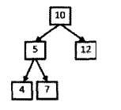
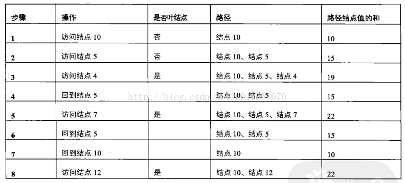

# 034-二叉树中和为某一值的路径

tags： 二叉树 前序遍历

---

## 题目原文

[牛客网链接]()

输入一颗二叉树的跟节点和一个整数，打印出二叉树中结点值的和为输入整数的所有路径。路径定义为从树的根结点开始往下一直到叶结点所经过的结点形成一条路径。(注意: 在返回值的list中，数组长度大的数组靠前)

**注意:** 路径从根节点开始从叶子节点结束

## 解题思路

[参考](https://blog.csdn.net/u010059070/article/details/75530070)

如下图所示的例子，给定了二叉树与整数22，则可以打印两条路径。第一条10，5，7、第二条10，12



题目中定义路径：从树的根节点开始一直到叶子结点所经过的结点形成一条路径

也就是说每条满足条件的路径都是以根节点开始，叶子结点结束，如果想得到所有根节点到叶子结点的路径（不一一定满足和为某整数的条件），需要遍历整棵树，还要先遍历根节点，所以采用先序遍历


以上面的树模拟先序遍历的过程

10-->5-->4  已近到达叶子结点，不满足要求22，因此该路径访问结束，需要访问下一个路径

因为在访问节点的过程中，我们并不知道该路径是否满足要求，所以我们每访问一个节点就要记录该结点

访问下有一个结点前，要先从结点4退回到结点5，再访问下一个结点7，因为4不在去往7的路径上，所以要在路径中将4删除

10-->5-->7  满足要求，保存该路径

访问下一个结点，从结点7回到结点5再回到结点10

10-->12，满足要求，保存该路径


整个流程如下图所示：



## 代码

### [c++代码](./src/cpp/034-二叉树中和为某一值的路径.cpp)


```c++
/*
struct TreeNode {
	int val;
	struct TreeNode *left;
	struct TreeNode *right;
	TreeNode(int x) :
			val(x), left(NULL), right(NULL) {
	}
};*/
class Solution {
public:
    vector<vector<int> > FindPath(TreeNode* root,int expectNumber) {
        vector<vector<int>> res;
        if(root==nullptr)
            return res;
        vector<int> path;
        int currentSum=0;
        FindPathCore(root,expectNumber,res,path,currentSum);
        return res;
    }
    
    void FindPathCore(TreeNode* root,int expectNumber,vector<vector<int>>& res, vector<int>& path,int currentSum){
        path.push_back(root->val);
        currentSum+=root->val;
        //如果是叶节点, 并且路径上节点值的和等于输入值,则保存路径
        bool isLeaf=(root->left==nullptr&&root->right==nullptr);
        if(currentSum==expectNumber&&isLeaf){
            res.push_back(path);
        }
        //如果不是叶节点, 则遍历其子节点
        if(root->left!=nullptr){
            FindPathCore(root->left,expectNumber,res,path,currentSum);
        }
        if(root->right!=nullptr){
            FindPathCore(root->right,expectNumber,res,path,currentSum);
        }
        // path需要pop_back而currentSum不需要减去root->val的原因是, 前者是传引用, 后者是传值
        path.pop_back();
    }
};
```

### [python代码](./src/python/034-二叉树中和为某一值的路径.py)

```python

```
