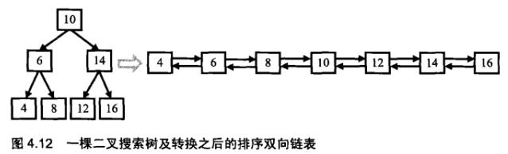

# 036-二叉搜索树与双向链表

tags： 二叉搜索树 中序遍历

---

## 题目原文

[牛客网链接](https://www.nowcoder.com/practice/947f6eb80d944a84850b0538bf0ec3a5?tpId=13&tqId=11179&tPage=2&rp=1&ru=%2Fta%2Fcoding-interviews&qru=%2Fta%2Fcoding-interviews%2Fquestion-ranking)

输入一棵二叉搜索树，将该二叉搜索树转换成一个排序的[双向链表](https://cuijiahua.com/blog/tag/双向链表/)。要求不能创建任何新的结点，只能调整树中结点指针的指向。

## 解题思路

[参考](https://cuijiahua.com/blog/2017/12/basis_26.html)



二叉搜索树如上图所示，我们将其转换为配需[双向链表](https://cuijiahua.com/blog/tag/双向链表/)。

根据二叉搜索树的特点：左结点的值<根结点的值<右结点的值，我们不难发现，使用[二叉树](https://cuijiahua.com/blog/tag/二叉树/)的中序遍历出来的数据的数序，就是排序的顺序。因此，首先，确定了二叉搜索树的遍历方法。

接下来，我们看下图，我们可以把树分成三个部分：值为10的结点、根结点为6的左子树、根结点为14的右子树。根据排序双向链表的定义，值为10的结点将和它的左子树的最大一个结点链接起来，同时它还将和右子树最小的结点链接起来。

按照中序遍历的顺序，当我们遍历到根结点时，它的左子树已经转换成一个排序的好的双向链表了，并且处在链表中最后一个的结点是当前值最大的结点。我们把值为8的结点和根结点链接起来，10就成了最后一个结点，接着我们就去遍历右子树，并把根结点和右子树中最小的结点链接起来。至于如何把左子树和右子树的内部节点链接为链表, 那和原来问题是一样的, 可以用递归解决.

在我们的递归函数中，我们用pLastNodeInList保存前一个访问的节点，我们采用中序访问的方式，将访问当前结点currNode的操作转换为将当前节点currNode与前一个节点pLastNodeInList链接成链表的方式。

由于我们每次需要更新pLastNodeInList的值，所以我们传递的参数是指向pLastNodeInList的指针

## 代码

### [c++代码](./src/cpp/036-二叉搜索树与双向链表.cpp)

```c++
/*
struct TreeNode {
	int val;
	struct TreeNode *left;
	struct TreeNode *right;
	TreeNode(int x) :
			val(x), left(NULL), right(NULL) {
	}
};*/
class Solution {
public:
    TreeNode* Convert(TreeNode* pRootOfTree)
    {
        if(pRootOfTree==nullptr)
            return nullptr;
        TreeNode* pLastNodeInList=nullptr;
        ConvertCore(pRootOfTree,&pLastNodeInList);
        while(pLastNodeInList!=nullptr&&pLastNodeInList->left!=nullptr)
            pLastNodeInList=pLastNodeInList->left;
        return pLastNodeInList;
    }
    void ConvertCore(TreeNode* pRootOfTree,TreeNode** pLastNodeInList){
        if(pRootOfTree==nullptr)
            return;
        TreeNode* currentNode=pRootOfTree;
        
        if(currentNode->left!=nullptr)
            ConvertCore(currentNode->left,pLastNodeInList);
        
        currentNode->left=*pLastNodeInList;
        
        if(*pLastNodeInList!=nullptr)
            (*pLastNodeInList)->right=currentNode;
        
        currentNode->left=*pLastNodeInList;
        *pLastNodeInList=currentNode;
        
        if(currentNode->right!=nullptr)
            ConvertCore(currentNode->right,pLastNodeInList);
    }
};
```

### [python代码](./src/python/036-二叉搜索树与双向链表.py)

```python

```
