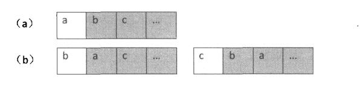

# 038_01-字符串的排列

tags： 全排列

---

## 题目原文

[牛客网链接](https://www.nowcoder.com/practice/fe6b651b66ae47d7acce78ffdd9a96c7?tpId=13&tqId=11180&tPage=2&rp=1&ru=%2Fta%2Fcoding-interviews&qru=%2Fta%2Fcoding-interviews%2Fquestion-ranking)

输入一个字符串,按字典序打印出该字符串中字符的所有排列。例如输入字符串abc,则打印出由字符a,b,c所能排列出来的所有字符串abc,acb,bac,bca,cab和cba。

牛客网的要求应该是只需要去重复, 不需要考虑按字母顺序输出.

## 解题思路

### 不考虑去重复和字母顺序输出

我们求整个字符串的排列，可以看成两步：首先求所有可能出现在第一个位置的字符，即把第一个字符和后面所有的字符交换。如下图所示：

[](https://cuijiahua.com/wp-content/uploads/2017/12/basis_27_1.jpg)

上图就是分别把第一个字符a和后面的b、c等字符交换的情形。首先固定第一个字符，求后面所有字符的排列。这个时候我们仍把后面的所有字符分为两部分：后面的字符的第一个字符，以及这个字符之后的所有字符。然后把第一个字符逐一和它后面的字符交换。

这个思路，是典型的递归思路。


```c++
class Solution {
public:
    vector<string> Permutation(string str) {
        //判断输入
        if(str.length() == 0){
            return result;
        }
        PermutationCore(str, 0);
        return result;
    }
    
private:
    void PermutationCore(string str, int begin){
        //递归结束的条件：第一位和最后一位交换完成
        if(begin == str.length()){
            result.push_back(str);
            return;
        }
        for(int i = begin; i < str.length(); i++){
            //位置交换
            swap(str[begin], str[i]);
            //递归调用，前面begin+1的位置不变，后面的字符串全排列
            PermutationCore(str, begin + 1);
        }
    }
    vector<string> result;
};
```

### 考虑去重复

对于形如 **aba** 或 **aa** 等特殊测试用例的情况

可在for循环中添加

```c++
        for(int i = begin; i < str.length(); i++){
            //如果字符串相同，则不交换
            if(i != begin && str[i] == str[begin]){
                continue;
            }
            //位置交换
            swap(str[begin], str[i]);
            //递归调用，前面begin+1的位置不变，后面的字符串全排列
            PermutationCore(str, begin + 1);
        }
```

### 考虑字母顺序输出

```c++
sort(result.begin(), result.end());
```

### STL的next_permutation求全排列

用STL的next_permutation可以很方便的求一个容器的全排列

[next_permutation](https://www.cnblogs.com/eudiwffe/p/6260699.html)

[prev_permutation](http://c.biancheng.net/view/598.html)

```c++
class Solution
{
public:
    vector<string> Permutation(string str)
    {
        vector<string> res;

        if(str.empty( ) == true)
        {
            return res;
        }
        sort(str.begin( ), str.end( ));

        do
        {
            res.push_back(str);
        }
        while(next_permutation(str.begin( ), str.end( )));


        return res;

    }
};
```


## 代码

### [c++代码](./src/cpp/038_01-字符串的排列.cpp)

```c++
class Solution {
public:
    vector<string> Permutation(string str) {
        //判断输入
        if(str.length() == 0){
            return result;
        }
        PermutationCore(str, 0);
        //对结果进行排序
        sort(result.begin(), result.end());
        return result;
    }
    
private:
    void PermutationCore(string str, int begin){
        //递归结束的条件：第一位和最后一位交换完成
        if(begin == str.length()){
            result.push_back(str);
            return;
        }
        for(int i = begin; i < str.length(); i++){
            //如果字符串相同，则不交换
            if(i != begin && str[i] == str[begin]){
                continue;
            }
            //位置交换
            swap(str[begin], str[i]);//str是传值形参, 所以递归返回后不会改变str
            //递归调用，前面begin+1的位置不变，后面的字符串全排列
            PermutationCore(str, begin + 1);
        }
    }
    vector<string> result;
};
```

### [python代码](./src/python/038_01-字符串的排列.py)

```python

```
