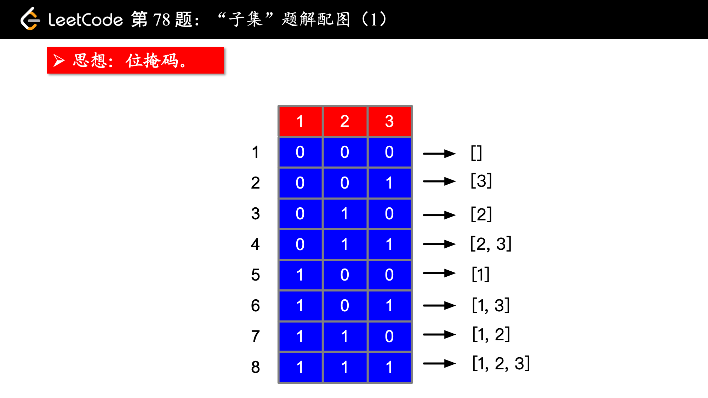
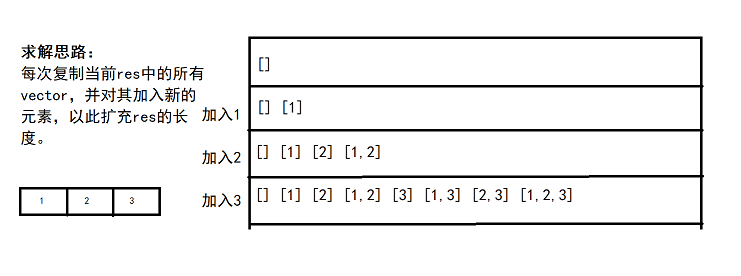

# 038_02-全组合-不含重复元素

tags： 全组合

---

## 题目原文

[leetcode链接](https://leetcode-cn.com/problems/subsets/)

给定一组不含重复元素的整数数组 nums，返回该数组所有可能的子集（幂集）。

**说明：**解集不能包含重复的子集。

**示例:**

```
输入: nums = [1,2,3]
输出:
[
  [3],
  [1],
  [2],
  [1,2,3],
  [1,3],
  [2,3],
  [1,2],
  []
]
```


## 解题思路

### 剑指offer的方法

[参考](https://www.cnblogs.com/zengshangzhi/p/9305534.html)

假设我们想在长度为n的字符串中求m个字符的组合。我们先从头扫描字符串的第一个字符。针对第一个字符，我们有两种选择：第一是把这个字符放到组合中去，接下来我们需要在剩下的n-1个字符中选取m-1个字符；第二是不把这个字符放到组合中去，接下来我们需要在剩下的n-1个字符中选择m个字符。这两种选择都很容易用递归实现。下面是这种思路的参考代码：

```c++
class Solution {
public:
    vector<vector<int>> subsets(vector<int>& nums) {
        if(nums.empty())
            return res;
        res.push_back(v);
        for(int i=1;i<=nums.size();i++){
            subsetsCore(nums,0,i);
        }
        return res;
    }
private:
    void subsetsCore(vector<int>& nums,int begin,int m){
        if(m==0){
            res.push_back(v);
            return;
        }
        if(begin==nums.size()){
            return;
        }
        v.push_back(nums[begin]);
        subsetsCore(nums,begin+1,m-1);
        v.pop_back();
        subsetsCore(nums,begin+1,m);
           
    }
    vector<int> v;
    vector<vector<int>> res;
};
```

### 位运算或者说bitmap

[参考](https://leetcode-cn.com/problems/subsets/solution/xiang-xi-tong-su-de-si-lu-fen-xi-duo-jie-fa-by--10/)

数组的每个元素，可以有两个状态，在子数组中和不在子数组中，所有状态的组合就是所有子数组了。

例如，nums = [ 1, 2 , 3 ]。1 代表在，0 代表不在。

1 2 3
0 0 0 -> [     ]
0 0 1 -> [    3]
0 1 0 -> [  2  ]   
0 1 1 -> [  2 3]  
1 0 0 -> [1    ]
1 0 1 -> [1   3] 
1 1 0 -> [1 2  ]
1 1 1 -> [1 2 3]



所以我们只需要遍历 0 0 0 到 1 1 1，也就是 0 到 7，然后判断每个比特位是否是 1，是 1 的话将对应数字加入即可。如果数组长度是 n，那么每个比特位是 2 个状态，所有总共就是 2 的 n 次方个子数组。遍历 00 ... 0 到 11 ... 1 即可。

或者

```
// 这种写法输出为: [[],[3],[2],[3,2],[1],[3,1],[2,1],[3,2,1]]
// 这种写法位掩码的对应情况为
/*
000->[]
001->[3]
010->[2]
011->[3,2]
...
*/

class Solution {
public:
    vector<vector<int>> subsets(vector<int>& nums) {
        int n = nums.size();
        int all = 1 << n;
        vector<vector<int>> res;//存放最后的结果
 
        for(int i = 0; i < all; i++){ 
            vector<int> vec;
            for(int j = 0; j < nums.size(); j++){
                if((i & (1 << j)) != 0){
                    vec.push_back(nums[j]);
                }
             }
            res.push_back(vec);
        }
        return res;
    }
};
```


```c++
// 这种写法输出为: [[],[1],[2],[1,2],[3],[1,3],[2,3],[1,2,3]]
// 这种写法位掩码的对应情况为
/*
000->[]
001->[1]
010->[2]
011->[1,2]
...
相当于把位掩码做水平镜像
*/
// 这么写计算量少一些
class Solution {
public:
    vector<vector<int>> subsets(vector<int>& nums) {
        int n = nums.size();
        int all = 1 << n;
        vector<vector<int>> res;//存放最后的结果
 
        for(int i = 0; i < all; i++){ 
            vector<int> vec;
            for(int j = 0; j < nums.size(); j++){
                if((i & (1 << j)) != 0){
                    vec.push_back(nums[j]);
                }
             }
            res.push_back(vec);
        }
        return res;
    }
};
```

### 迭代法

[参考](https://blog.csdn.net/camellhf/article/details/73551410)

一个规律，集合中每添加一个元素，则子集数目增加一倍，且增加的子集为所有原始子集加上新的元素。举个例子：nums=[1,2,3] 

1. 初始时集合为空，子集为[ [] ]。 
2. 添加一个元素1,即集合为[1]时，子集为空集和空集+元素1，即[ [], [1] ]。 
3. 添加下一个元素2，集合为[1,2]，子集除了包含上一步的所有集合还新增了对应集合+元素2的所有集合，即[ [], [1], [2], [1,2]]，其中[2]是空集+元素2，[1,2]是[1]+元素2。 
4. 添加下一个元素3，集合为[1,2,3]，类似的得到子集为[ [], [1], [2], [1,2], [3], [1,3], [2,3], [1,2,3] ]，其中[3]是空集+元素3，[1,3]是[1]+元素3，[2,3]是[2]+元素3，[1,2,3]是[1,2]+元素3。 
因此，利用这个规律构建子集，实现过程见参考代码



```c++
class Solution {
public:
    vector<vector<int>> subsets(vector<int>& nums) {
        vector<vector<int>> res(1, vector<int>());

        for (int i = 0; i < nums.size(); i++) {
            int n = res.size();
            for (int j = 0; j < n; j++) {
                res.push_back(res[j]);
                res.back().push_back(nums[i]);
            }
        }

        return res;
    }
};
```


### 总结

[参考](https://blog.csdn.net/camellhf/article/details/73551410)

这道题蛮简单的，关键是要通过不同的解法开阔自己的思路，做题最重要的不是AC，而是在于通过后进行总结反思。通过学习其他人的代码，我学到了很多小技巧，尽管不可能直接在其他题目上套用，但是会对其他题的思考有所启发。 

## 代码

### [c++代码](./src/cpp/038_02-全组合-不含重复元素.cpp)

```c++
class Solution {
public:
    vector<vector<int>> subsets(vector<int>& nums) {
        if(nums.empty())
            return res;
        res.push_back(v);
        for(int i=1;i<=nums.size();i++){
            subsetsCore(nums,0,i);
        }
        return res;
    }
private:
    void subsetsCore(vector<int>& nums,int begin,int m){
        if(m==0){
            res.push_back(v);
            return;
        }
        if(begin==nums.size()){
            return;
        }
        v.push_back(nums[begin]);
        subsetsCore(nums,begin+1,m-1);
        v.pop_back();
        subsetsCore(nums,begin+1,m);
           
    }
    vector<int> v;
    vector<vector<int>> res;
};
```

### [python代码](./src/python/038_02-全组合-不含重复元素.py)

```python

```
