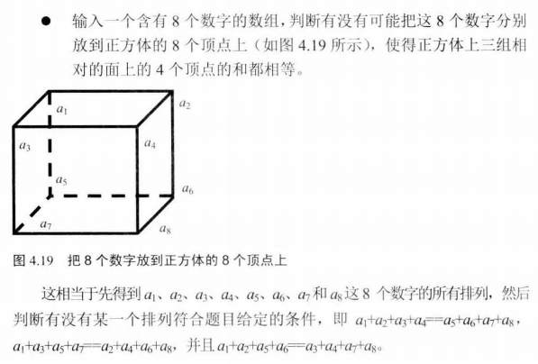

# 038_04-对面和相等的正方体

tags： 全排列

---

## 题目原文




## 代码

### [c++代码](./src/cpp/038_04-对面和相等的正方体.cpp)

```c++
#include<iostream>
#include<vector>
using namespace std;
class Solution {
public:
	vector<vector<int>> Permutation(vector<int> nums) {
		if (nums.empty())
			return res;
		PermutationCore(nums, 0);
		return res;
	}

	void PermutationCore(vector<int> nums, int begin) {

		if (begin == nums.size()) {
			if (nums[0] + nums[1] + nums[2] + nums[3] == nums[4] + nums[5] + nums[6] + nums[7] &&
				nums[0] + nums[2] + nums[4] + nums[6] == nums[1] + nums[3] + nums[5] + nums[7] &&
				nums[0] + nums[1] + nums[4] + nums[5] == nums[2] + nums[3] + nums[6] + nums[7])
				res.push_back(nums);
			return;
		}
		for (int i = begin; i<nums.size(); i++) {
			swap(nums[i], nums[begin]);
			PermutationCore(nums, begin + 1);
		}
	}

	vector<vector<int>> res;
};
int main() {
	Solution s;
	vector<int> nums{ 1,2,3,4,5,6,7,8 };
	s.Permutation(nums);
	for (int i = 0; i < s.res.size(); i++) {
		for (int j = 0; j < s.res[i].size(); j++)
			cout << s.res[i][j];
		cout << endl;
	}
	system("pause");
	return 0;
}
```

### [python代码](./src/python/038_04-对面和相等的正方体.py)

```python

```
