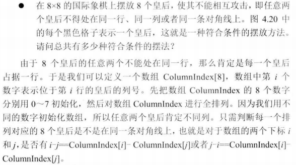

# 038_05-N皇后

tags：全排列

---

## 题目原文

[leetcode链接](https://leetcode-cn.com/problems/n-queens/)

n 皇后问题研究的是如何将 n 个皇后放置在 n×n 的棋盘上，并且使皇后彼此之间不能相互攻击。


上图为 8 皇后问题的一种解法。

给定一个整数 n，返回所有不同的 n 皇后问题的解决方案。

每一种解法包含一个明确的 n 皇后问题的棋子放置方案，该方案中 'Q' 和 '.' 分别代表了皇后和空位。


## 解题思路

### 剑指offer



## 代码

### [c++代码](./src/cpp/038_05-N皇后.cpp)

剑指offer的思路

```c++
class Solution {
public:
    vector<vector<string>> solveNQueens(int n) {
        if(n<=0)
            return res;
        vector<int> nums;
        nums.resize(n);
        for(int i=0;i<n;i++)
            nums[i]=i;
        solveNQueensCore(nums,0);
        return res;
    }
    
    void solveNQueensCore(vector<int> &nums, int begin){
        if(begin==nums.size()){
            if(check(nums))
                draw(nums);
            return;
        }
        for(int i=begin;i<nums.size();i++){
            swap(nums[begin],nums[i]);
            solveNQueensCore(nums,begin+1);
            swap(nums[begin],nums[i]);
        }
        
    }
    
    bool check(vector<int>& nums){
        for(int i=0;i<nums.size();i++){
            for(int j=0;j<nums.size();j++){
                if(i==j)
                    continue;
                if(fabs(nums[i]-nums[j])==j-i){
                    return false;
                }
            }
        }
        return true;
    }
    
    void draw(vector<int>& nums){
        string temp(nums.size(),'.');
        vector<string> v(nums.size(),temp);
        for(int i=0;i<nums.size();i++){
            v[nums[i]][i]='Q';
        }
        res.push_back(v);
        
    }
    vector<vector<string>> res;
    

};
```

### [python代码](./src/python/038_05-N皇后.py)

```python

```
