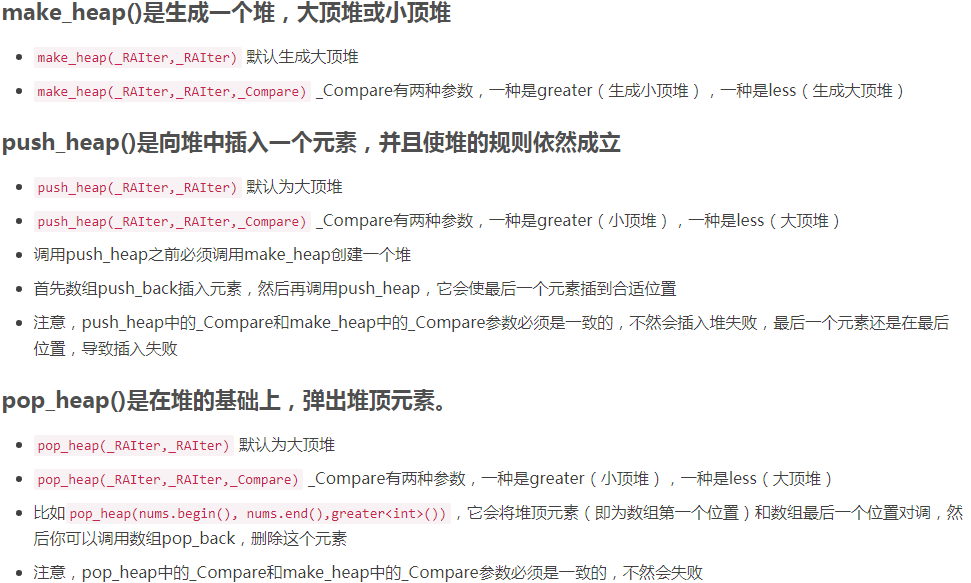

# 041-数据流中的中位数

tags： 最大堆 最小堆

---

## 题目原文

[牛客网链接](https://www.nowcoder.com/practice/9be0172896bd43948f8a32fb954e1be1?tpId=13&tqId=11216&tPage=4&rp=1&ru=%2Fta%2Fcoding-interviews&qru=%2Fta%2Fcoding-interviews%2Fquestion-ranking)

如何得到一个数据流中的中位数？如果从数据流中读出奇数个数值，那么中位数就是所有数值排序之后位于中间的数值。如果从数据流中读出偶数个数值，那么中位数就是所有数值排序之后中间两个数的平均值。我们使用Insert()方法读取数据流，使用GetMedian()方法获取当前读取数据的中位数。

## 解题思路

### 思路概述

[参考](https://blog.csdn.net/wjh2622075127/article/details/82846743)

这道题有很多种解法, 关键在于选取合适的数据结构

一. 暴力一点的是有序数组, 读入一个数据就将其有序化, 然后直接输出中位数. 这样插入一个数复杂度为O(n), 查找为O(1);

二. 或者使用有序链表, 插入的复杂度为O(n), 查找为O(1). 为什么查找中位数可以是O(1)? 因为可以定义两个指针, 分别指向中间的两个数, 如果总数为奇数则同时指向最中间的数. 在插入的过程中, 我们可以记录遍历的位置, 判断是在左边插入还是右边, 从而可以调整中间指针所指向的位置. 这种思路非常巧妙.

但无论是有序数组或是有序链表, 插入的复杂度都有些过高了.

三. 于是我们可以使用二叉搜索树, 于是插入的平均时间复杂度为O(logn), 查找也为O(logn). 但是在极端情况下, 由于二叉搜索树本身不具有平衡性, 所以可能成链状, 最坏会退化成O(n)的插入和查找操作.

四. 针对这个问题, 我们可以使用二叉平衡搜索树(AVL树), 这样插入的时间复杂度为O(logn), 同时利用AVL树的特殊性, 找到中位数只需O(1)的时间.

五. 另一种方法是使用堆, 最大堆+最小堆. 这两个堆把数据流分成两部分, 插入的操作O(logn), 查询操作O(1). 具体如何实现? 对于第i个数, 当i - 1 为奇数, 向最大堆插入, 如果最大堆最大大于最小堆最小, 则交换, 同时向下调整; 当i - 1为偶数, 向最小堆插入, 如果有最大堆大于最小堆最小, 则交换, 同时向下调整.

六. 也可以使用红黑树, 它们的功能都是类似的. 因为红黑树比较难写, 省时些的话, 直接利用 STL的multiset 即可.

### 最大堆 最小堆

参考

> [数据结构：堆（Heap）](https://www.jianshu.com/p/6b526aa481b1)
>
> [数据结构——堆（Heap）大根堆、小根堆](https://www.cnblogs.com/wangchaowei/p/8288216.html)
>
> [8-玩转数据结构-堆](https://cloud.tencent.com/developer/article/1192923)

我们将数据分为两部分，位于左边最大堆的数据比右边最小堆的数据要小，左、右两边内部的数据没有排序，也可以根据左边最大的数及右边最小的数得到中位数。

接下来考虑用最大堆和最小堆实现的一些细节。

首先要保证数据平均分配到两个堆中，因此两个堆中数据的数目之差不能超过1.为了实现平均分配，可以在数据的总数目是偶数时把新数据插入到最小堆中，否则插入到最大堆中。

此外，还要保证最大堆中所有数据小于最小堆中数据。所以，新传入的数据需要先和最大堆的最大值或者最小堆中的最小值进行比较。以总数目为偶数为例，按照我们制定的规则，新的数据会被插入到最小堆中，但是在这之前，我们需要判断这个数据和最大堆中的最大值谁更大，如果最大堆中的数据比较大，那么我们就需要把当前数据插入最大堆，然后弹出新的最大值，再插入到最小堆中。由于最终插入到最小堆的数字是原最大堆中最大的数字，这样就保证了最小堆中所有数字都大于最大堆的数字。

## 知识点

### 最大堆 最小堆

[参考](https://www.jianshu.com/p/6b526aa481b1)

#### 堆属性

堆分为两种：*最大堆*和*最小堆*，两者的差别在于节点的排序方式。

在最大堆中，父节点的值比每一个子节点的值都要大。在最小堆中，父节点的值比每一个子节点的值都要小。这就是所谓的“堆属性”，并且这个属性对堆中的每一个节点都成立。

例子：


这是一个最大堆，，因为每一个父节点的值都比其子节点要大。`10` 比 `7` 和 `2` 都大。`7` 比 `5` 和 `1`都大。

根据这一属性，那么最大堆总是将其中的最大值存放在树的根节点。而对于最小堆，根节点中的元素总是树中的最小值。堆属性非常的有用，因为堆常常被当做优先队列使用，因为可以快速的访问到“最重要”的元素。

> **注意：**堆的根节点中存放的是最大或者最小元素，但是其他节点的排序顺序是未知的。例如，在一个最大堆中，最大的那一个元素总是位于 index 0 的位置，但是最小的元素则未必是最后一个元素。--唯一能够保证的是最小的元素是一个叶节点，但是不确定是哪一个。

#### 来自数组的树

用数组来实现树相关的数据结构也许看起来有点古怪，但是它在时间和空间山都是很高效的。

我们准备将上面的例子中的树这样存储：

```
[ 10, 7, 2, 5, 1 ]
```

就这多！我们除了一个简单的数组以外，不需要任何额外的空间。

如果我们不允许使用指针，那么我们怎么知道哪一个节点是父节点，哪一个节点是它的子节点呢？问得好！节点在数组中的位置index 和它的父节点已经子节点的索引之间有一个映射关系。

如果 `i` 是节点的索引，那么下面的公式就给出了它的父节点和子节点在数组中的位置：

```
parent(i) = floor((i - 1)/2)
left(i)   = 2i + 1
right(i)  = 2i + 2
```

注意 `right(i)` 就是简单的 `left(i) + 1`。左右节点总是处于相邻的位置。


### STL

参考:

> [make_heap(), pop_heap(), push_heap()用法](https://blog.csdn.net/qq_29630271/article/details/66478256)
>
> [STL--heap概述：make_heap,sort_heap,pop_heap,push_heap](https://www.cnblogs.com/likui360/p/6364896.html)



## 代码

### [c++代码](./src/cpp/041-数据流中的中位数.cpp)

```c++
class Solution {
public:
    void Insert(int num)
    {
        if(((max.size()+min.size())&1)==0){// 堆的总长度为偶数时, 添加新元素到最小堆
            if(max.size()>0&&num<max[0]){
                max.push_back(num);
                push_heap(max.begin(),max.end(),less<int>());
                num=max[0];
                pop_heap(max.begin(),max.end(),less<int>());
                max.pop_back();
            }
            min.push_back(num);
            push_heap(min.begin(),min.end(),greater<int>());
        }else{// 堆的总长度为奇数时, 添加新元素到最大堆
            if(min.size()>0&&num>min[0]){
                min.push_back(num);
                push_heap(min.begin(),min.end(),greater<int>());
                num=min[0];
                pop_heap(min.begin(),min.end(),greater<int>());
                min.pop_back();
            }
            max.push_back(num);
            push_heap(max.begin(),max.end(),less<int>());
        }
    }

    double GetMedian()
    { 
        int size=max.size()+min.size();
        double res=0;
        if(size==0)
            throw new std::logic_error("invalid input");
        if((size&1)==0)
            res=(max[0]+min[0])/2.;//这里要注意整数和整数相除结果是整数, 所以应该除以2.
        else
            res=min[0];//因为先从最小堆开始放, 如果数据总长度是奇数, 那么最后一个元素一定在最小堆
        return res;
    }

    vector<int> max;//最大堆
    vector<int> min;//最小堆
};
```

### [python代码](./src/python/041-数据流中的中位数.py)

```python

```
