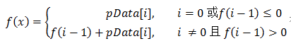

# 042-连续子数组的最大和

tags： 贪婪算法 动态规划

---

## 题目原文

[牛客网链接](https://www.nowcoder.com/practice/459bd355da1549fa8a49e350bf3df484?tpId=13&tqId=11183&tPage=2&rp=1&ru=%2Fta%2Fcoding-interviews&qru=%2Fta%2Fcoding-interviews%2Fquestion-ranking)

HZ偶尔会拿些专业问题来忽悠那些非计算机专业的同学。今天测试组开完会后,他又发话了:在古老的一维模式识别中,常常需要计算连续子向量的最大和,当向量全为正数的时候,问题很好解决。但是,如果向量中包含负数,是否应该包含某个负数,并期望旁边的正数会弥补它呢？例如:{6,-3,-2,7,-15,1,2,2},连续子向量的最大和为8(从第0个开始,到第3个为止)。给一个数组，返回它的最大连续子序列的和，你会不会被他忽悠住？(子向量的长度至少是1)

## 解题思路

[参考]([https://github.com/gatieme/CodingInterviews/tree/master/031-%E8%BF%9E%E7%BB%AD%E5%AD%90%E6%95%B0%E7%BB%84%E7%9A%84%E6%9C%80%E5%A4%A7%E5%92%8C](https://github.com/gatieme/CodingInterviews/tree/master/031-连续子数组的最大和))

### 动态规划

解体思路：

如果用函数f(i)表示以第i个数字结尾的子数组的最大和，那么我们需要求出max(f[0...n])。我们可以给出如下递归公式求f(i)

[](https://github.com/gatieme/CodingInterviews/blob/master/031-连续子数组的最大和/dp.png)

这个公式的意义：

1. 当以第(i-1)个数字为结尾的子数组中所有数字的和f(i-1)小于0时，如果把这个负数和第i个数相加，得到的结果反而不第i个数本身还要小，所以这种情况下最大子数组和是第i个数本身。
2. 如果以第(i-1)个数字为结尾的子数组中所有数字的和f(i-1)大于0，与第i个数累加就得到了以第i个数结尾的子数组中所有数字的和

```c++
class Solution{
    int dp[1000];
public:
    int FindGreatestSumOfSubArray(vector<int> array){
        if(array.size( ) == 0)
            return 0;
        int maxSum = INT_MIN;
        dp[0] = array[0];

        for(unsigned int i = 1; i < array.size( ); i++)
        {
            if(dp[i - 1] <= 0)
                dp[i] = array[i];
            else
                dp[i] = array[i] + dp[i - 1];
            
            if(dp[i] > maxSum)
                maxSum = dp[i];
        }
        return maxSum;
    }
};
```


### 贪婪思想

> 如果希望达到O(n)时间复杂度，我们就应该能够想到我们只能对整个数组进行一次扫描，在扫描过程中求出最大连续子序列和以及子序列的起点和终点位置。

假如输入数组为{1,-2,3,10,-4,7,2,-5}，我们尝试从头到尾累加其中的正数，

初始化和为0，第一步加上1，此时和为1，第二步加上-2，此时和为-1，第三步加上3，此时我们发现-1+3=2，最大和2反而比3一个单独的整数小，这是因为3加上了一个负数，发现这个规律以后我们就重新作出累加条件

这个方法其实就是动态规划算法的改进

- 如果当前和为负数，那么就放弃前面的累加和，从数组中的下一个数再开始计数
- 否则我们就继续累计，并且保存当前最大的累计和

```c++
class Solution
{
public:
    int FindGreatestSumOfSubArray(vector<int> array)
    {
        if(array.size( ) == 0)
            return 0;

        int sum = 0, maxSum = INT_MIN;

        for(int i = 0; i < array.size( ); i++)
        {
            sum += array[i];
            debug <<sum <<endl;

            if(sum < 0)     ///  如果当前和小于0, 就舍弃它, 重新开始累加
                sum = 0;
            else if(sum > maxSum)   ///  否则的话累计当前和
                maxSum = sum;
        }
        return maxSum;
    }
};
```

但是这个有一个问题，如果整个数组的数据全是负数，那么我们的maxSum无法进行累计，最后仍为0。

这个问题怎么解决呢?

整个数组全是负数，那么最大值也是负数，而这个最大值正好是数组连续子数组的最大和，因此我们维护一个最大值maxNum，即可

- 如果maxNum<0，我们就直接返回maxNum
- 如果maxNum>0，那么我们就返回累计的maxSum

```
return (maxNum > 0) ? maxSum : maxNum;
```

完整代码如下

```c++
class Solution{
public:
    int FindGreatestSumOfSubArray(vector<int> array)
    {
        if(array.size( ) == 0)
            return 0;
        
        int maxNum = INT_MIN;
        int sum = 0, maxSum = INT_MIN;

        for(int i = 0; i < array.size( ); i++)
        {
            sum += array[i];
            debug <<sum <<endl;
            if(sum < 0)     ///  如果当前和小于0, 就舍弃它, 重新开始累加
                sum = 0;
            else if(sum > maxSum)   ///  否则的话累计当前和
                maxSum = sum;
            ///  保存数据中的最大值
            ///  这种情况下是为了排除整个数组全为负数的特殊情况
            if(array[i] > maxNum)
                maxNum = array[i];
        }
        ///  如果数组最大值大于0, 那么我们就直接返回累计的最大和
        ///  如果数组最大值为负数, 说明整个数组都是负数, 那么就返回数组最大值
        return (maxNum > 0) ? maxSum : maxNum;
    }
};
```

但是其实有更好的办法，每次弄完后我们无需设置那个sum置为0，而是需要从新的位置（下一个位置）开始，因此此时其实sum=array[i + 1];

那么我们直接用下面的代码即可

```c++
class Solution
{
public:
    int FindGreatestSumOfSubArray(vector<int> array)
    {
        if(array.empty())
            throw new std::logic_error("invalid input");
        int sum=0;
        int maxSum=INT_MIN;
        
        for(int i=0;i<array.size();i++){
            if(sum<=0)
                sum=array[i];
            else
                sum+=array[i];
            if(sum>maxSum)
                maxSum=sum;
        }
        return maxSum;
    }
};
```


## 代码

### [c++代码](./src/cpp/042-连续子数组的最大和.cpp)

```c++
class Solution
{
public:
    int FindGreatestSumOfSubArray(vector<int> array)
    {
        if(array.empty())
            throw new std::logic_error("invalid input");
        int sum=0;
        int maxSum=INT_MIN;
        
        for(int i=0;i<array.size();i++){
            if(sum<=0)
                sum=array[i];
            else
                sum+=array[i];
            if(sum>maxSum)
                maxSum=sum;
        }
        return maxSum;
    }
};
```

### [python代码](./src/python/042-连续子数组的最大和.py)

```python

```
