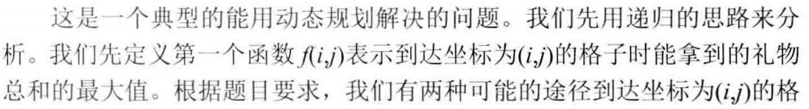
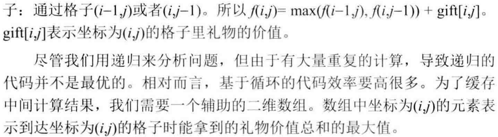
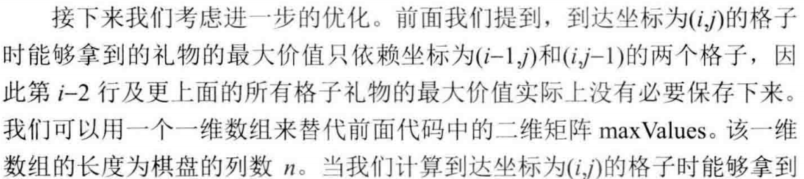
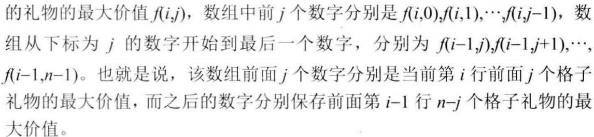

# 047-礼物的最大价值

tags： 动态规划

---

## 题目原文

[acwing链接](https://www.acwing.com/problem/content/56/)

在一个m×n的棋盘的每一格都放有一个礼物，每个礼物都有一定的价值（价值大于0）。

你可以从棋盘的左上角开始拿格子里的礼物，并每次向右或者向下移动一格直到到达棋盘的右下角。

给定一个棋盘及其上面的礼物，请计算你最多能拿到多少价值的礼物？

**注意：**

- m,n>0m,n>0

样例：

```
输入：
[
  [2,3,1],
  [1,7,1],
  [4,6,1]
]

输出：19

解释：沿着路径 2→3→7→6→1 可以得到拿到最大价值礼物。
```

## 解题思路

### 二维数组作为辅助空间





### 一维数组作为辅助空间





## 代码

### [c++代码](./src/cpp/047-礼物的最大价值.cpp)

```c++
class Solution {
public:
    int getMaxValue(vector<vector<int>>& grid) {
        if(grid.empty()||grid[0].empty())
            return 0;
        int rows=grid.size();
        int cols=grid[0].size();
        
        vector<int> res(cols);
        for(int i=0;i<rows;i++){
            for(int j=0;j<cols;j++){
                int left=0,up=0;
                if(i>0)
                    up=res[j];
                if(j>0)
                    left=res[j-1];
                res[j]=max(up,left)+grid[i][j];
            }
        }
        return res[cols-1];
    }
};
```

### [python代码](./src/python/047-礼物的最大价值.py)

```python

```
