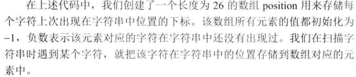

# 048-最长不含重复字符的子字符串

tags： 动态规划

---

## 题目原文

[acwing链接](https://www.acwing.com/problem/content/57/)

请从字符串中找出一个最长的不包含重复字符的子字符串，计算该最长子字符串的长度。

假设字符串中只包含从’a’到’z’的字符。

## 解题思路




## 代码

### [c++代码](./src/cpp/048-最长不含重复字符的子字符串.cpp)

```c++
class Solution {
public:
    int longestSubstringWithoutDuplication(string s) {
        if(s.empty())
            return 0;
        
        int curLength=0;
        int maxLength=0;
        
        vector<int> pos(26,-1);
        
        for(int i=0;i<s.size();i++){
            int pre_pos=pos[s[i]-'a'];
            if(pre_pos<0||i-pre_pos>curLength)
                curLength++;
            else{
                if(curLength>maxLength)
                    maxLength=curLength;
                
                curLength=i-pre_pos;
            }
            pos[s[i]-'a']=i;
        }
        if(curLength>maxLength)
            maxLength=curLength;
        return maxLength;
        
    }
};
```

### [python代码](./src/python/048-最长不含重复字符的子字符串.py)

```python

```
