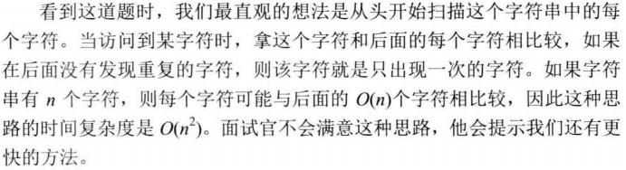
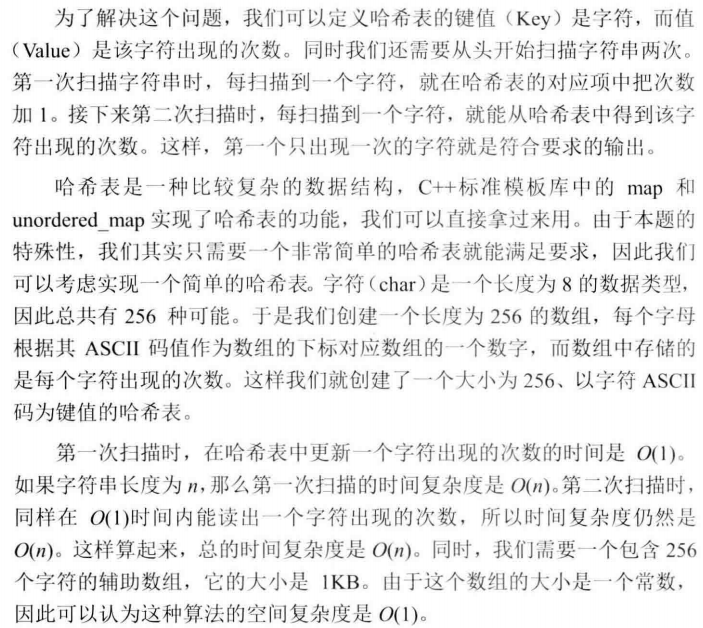
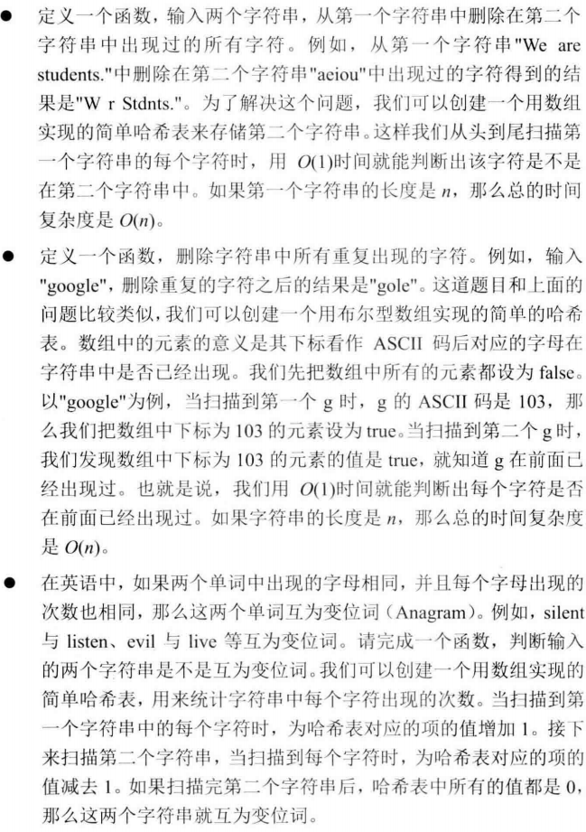

# 050_01-第一个只出现一次的字符

tags： 哈希表

---

## 题目原文

[牛客网链接](https://www.nowcoder.com/practice/1c82e8cf713b4bbeb2a5b31cf5b0417c?tpId=13&tqId=11187&tPage=2&rp=1&ru=%2Fta%2Fcoding-interviews&qru=%2Fta%2Fcoding-interviews%2Fquestion-ranking)

在一个字符串(0<=字符串长度<=10000，全部由字母组成)中找到第一个只出现一次的字符,并返回它的位置, 如果没有则返回 -1（需要区分大小写）.

## 解题思路

### 暴力法



### 哈希表计数法



```c++
class Solution {
public:
    int FirstNotRepeatingChar(string str) {
        if(str.empty())
            return -1;
        unsigned int hashTable[256]={0};
        int i=0;
        for(;i<str.size();i++)
            hashTable[str[i]]++;
        for(i=0;i<str.size();i++){
            if(hashTable[str[i]]==1)
                break;
        }
        return i;
    }
};
```

## 关于有符号数和无符号数的转换

> [关于有符号数和无符号数的转换 - C/C++](https://www.cnblogs.com/lakeone/p/4985373.html)
>
> [char, unsigned char, int,unsigned int之间的相互转换](https://blog.csdn.net/WZJwzj123456/article/details/84679383)

无符号整数和有符号整数之间进行强制类型转换时，位模式不改变。

有符号数转换为无符号数时，负数转换为大的正数，相当于在原值上加上2的n次方，而正数保持不变。

无符号数转换为有符号数时，对于小的数将保持原值，对于大的数将转换为负数，相当于原值减去2的n次方。

当表达式中存在有符号数和无符号数类型时，所有的操作都自动转换为无符号类型。可见无符号数的运算优先级高于有符号数。

```
unsigned int a = 20;
signed int b = -130;
```

 运算一下结果是 b>a 。

## 代码

### [c++代码](./src/cpp/050_01-第一个只出现一次的字符.cpp)

```c++
class Solution {
public:
    int FirstNotRepeatingChar(string str) {
        if(str.empty())
            return -1;
        unsigned int hashTable[256]={0};
        int i=0;
        for(;i<str.size();i++)
            hashTable[str[i]]++;
        for(i=0;i<str.size();i++){
            if(hashTable[str[i]]==1)
                break;
        }
        return i;
    }
};
```

### [python代码](./src/python/050_01-第一个只出现一次的字符.py)

```python

```

## 举一反三

