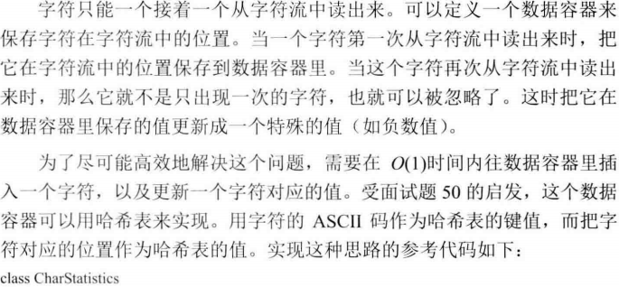
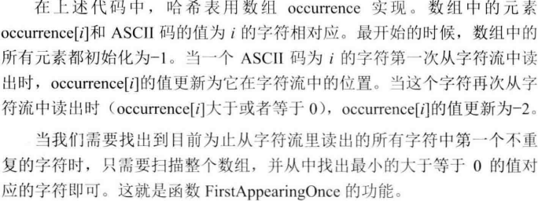

# 050_02-字符流中第一个只出现一次的字符

tags： 哈希表

---

## 题目原文

[acwing链接](https://www.acwing.com/problem/content/60/)

请实现一个函数用来找出字符流中第一个只出现一次的字符。

例如，当从字符流中只读出前两个字符”go”时，第一个只出现一次的字符是’g’。

当从该字符流中读出前六个字符”google”时，第一个只出现一次的字符是’l’。

如果当前字符流没有存在出现一次的字符，返回#字符。

#### 样例

```
输入："google"

输出："ggg#ll"

解释：每当字符流读入一个字符，就进行一次判断并输出当前的第一个只出现一次的字符。
```

## 解题思路





## C++ - 内置类型的最大值宏定义

> [C++ - 内置类型的最大值宏定义](https://blog.csdn.net/caroline_wendy/article/details/24311895)

## 代码

### [c++代码](./src/cpp/050_02-字符流中第一个只出现一次的字符.cpp)

```c++
class Solution{
public:
    //Insert one char from stringstream
    Solution():index(0){
        for(int i=0;i<256;i++)
            occurrence[i]=-1;
    }

    void insert(char ch)
    {
        if(occurrence[ch] == -1)
            occurrence[ch] = index;
        else if(occurrence[ch] >= 0)
            occurrence[ch] = -2;

        index++;
    }

    char firstAppearingOnce()
    {
        char ch;
        int minIndex = INT_MAX;
        for(int i = 0; i < 256; ++i)
        {
            if(occurrence[i] >= 0 && occurrence[i] < minIndex)
            {
                ch = (char) i;
                minIndex = occurrence[i];
            }
        }
        if(minIndex == INT_MAX)
        return '#';
        else
        return ch;
    }
private:
    int index;
    // occurrence[i]: A character with ASCII value i;
    // occurrence[i] = -1: The character has not found;
    // occurrence[i] = -2: The character has been found for mutlple times
    // occurrence[i] >= 0: The character has been found only once
    int occurrence[256];
};
```

### [python代码](./src/python/050_02-字符流中第一个只出现一次的字符.py)

```python

```
