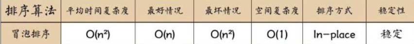
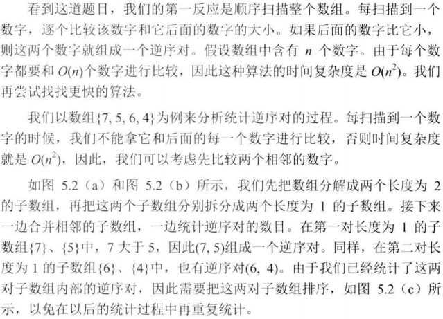
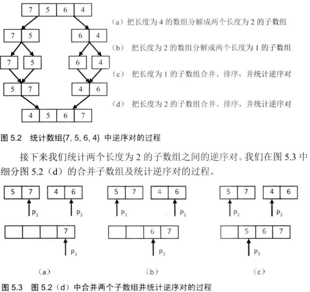
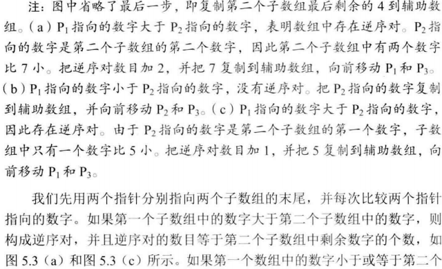
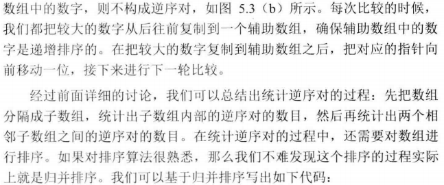
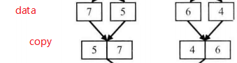
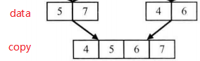
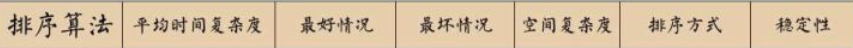
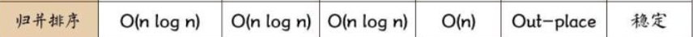

# 051-数组中的逆序对

tags： 归并排序

---

## 题目原文

[牛客网链接](https://www.nowcoder.com/practice/96bd6684e04a44eb80e6a68efc0ec6c5?tpId=13&tqId=11188&tPage=2&rp=1&ru=%2Fta%2Fcoding-interviews&qru=%2Fta%2Fcoding-interviews%2Fquestion-ranking)

在数组中的两个数字，如果前面一个数字大于后面的数字，则这两个数字组成一个逆序对。输入一个数组,求出这个数组中的逆序对的总数P。并将P对1000000007取模的结果输出。 即输出P%1000000007

**输入描述:**

```
题目保证输入的数组中没有的相同的数字数据范围：	对于%50的数据,size<=10^4	对于%75的数据,size<=10^5	对于%100的数据,size<=2*10^5
```

示例1

输入

```
1,2,3,4,5,6,7,0
```

输出

```
7
```

## 解题思路

### 冒泡排序

考虑一下，逆序是说a[i]>a[j]，i<j。那么在排序的过程中，会把a[i]和a[j]交换过来，这个交换的过程，每交换一次，就是一个逆序对的“正序”过程。

因为



所以, 下面的程序在牛客上是不能通过的, 超时, 下面的代码只是作为一种思路的参考

```c++
class Solution {
public:
    int InversePairs(vector<int> elem)
    {
        if(elem.size( ) == 0)
        {
            return 0;
        }

        return BubbleSort(elem)%1000000007;
    }

    long BubbleSort(vector<int> elem)
    {
        bool flag = true;
        int count = 0;
        unsigned int length = elem.size( );

        for(unsigned int i = 0;
            i < length - 1 && flag == true;
            i++)  // 共计进行length-1趟循环
        {
            flag = false;           // 初始默认数据是无序的
            for(unsigned int j = 0;
                j < length - i - 1;
                j++)   // 每趟循环比较length-1-j次
            {
                if(elem[j] > elem[j + 1])    // 如果当前的元素与后一个元素不满足排序规则
                {
                    swap(elem[j], elem[j+1]);
                    flag = true;  // 仍然需要交换说明, 仍然无序
                    count++;
                }
            }
        }

        return count;
    }
};
```


### 归并排序









```c++
class Solution {
public:
    int InversePairs(vector<int> data) {
        if(data.empty())
            return 0;
        //排序的辅助数组
        int length=data.size();
        vector<int> copy(length);
        for(int i=0;i<length;i++)
            copy[i]=data[i];
        return InversePairsCore(data,copy,0,length-1)%1000000007;
    }
    long InversePairsCore(vector<int>& data, vector<int>&copy,int begin,int end){
        if(begin==end){
            copy[begin]=data[end];
            return 0;
        }
        // 求中点
        int mid=(begin+end)>>1;
        // 使data左半段有序，并返回左半段逆序对的数目
        long leftCount=InversePairsCore(copy,data,begin,mid);
        // 使data右半段有序，并返回右半段逆序对的数目
        long rightCount=InversePairsCore(copy,data,mid+1,end);
        
        int i=mid;// i初始化为前半段最后一个数字的下标
        int j=end;// j初始化为后半段最后一个数字的下标
        int idx_copy=end;// 辅助数组复制的数组的最后一个数字的下标
        long count=0;// 计数，逆序对的个数，注意类型
        
        while(i>=begin&&j>=mid+1){
            if(data[i]>data[j]){
                copy[idx_copy--]=data[i--];
                count+=j-mid;
            }
            else{
                copy[idx_copy--]=data[j--];
            }
        }
        for(;i>=begin;i--)
            copy[idx_copy--]=data[i];
        for(;j>=mid+1;j--)
            copy[idx_copy--]=data[j];
        return leftCount+rightCount+count;
    }
};
```


#### 注意

代码中InversePairsCore形参的顺序是(data,copy)，而递归调用时实参是(copy,data)。

这里调换二者顺序的原因解释如下

InversePairsCore函数可以如此理解, 它是对data的左右半段进行合并，复制到辅助数组copy中有序。

在下图中, 把data合并,复制到copy中,



在递归返回时, 也是要 把data合并,复制到copy中. 但是下图中的data却是上图中的copy. 所以在递归调用时, 要为(copy,data)



## 归并排序





[参考](https://www.cnblogs.com/chengxiao/p/6194356.html)

### 基本思想

　　归并排序（MERGE-SORT）是利用**归并**的思想实现的排序方法，该算法采用经典的**分治**（divide-and-conquer）策略（分治法将问题**分**(divide)成一些小的问题然后递归求解，而**治(conquer)**的阶段则将分的阶段得到的各答案"修补"在一起，即分而治之)。

**分而治之**


 　　可以看到这种结构很像一棵完全二叉树，本文的归并排序我们采用递归去实现（也可采用迭代的方式去实现）。**分**阶段可以理解为就是递归拆分子序列的过程，递归深度为log2n。

### 合并相邻有序子序列

　　再来看看**治**阶段，我们需要将两个已经有序的子序列合并成一个有序序列，比如上图中的最后一次合并，要将[4,5,7,8]和[1,2,3,6]两个已经有序的子序列，合并为最终序列[1,2,3,4,5,6,7,8]，来看下实现步骤。


## 代码

### [c++代码](./src/cpp/051-数组中的逆序对.cpp)

几个易错点

- InversePairsCore递归调用和函数定义的data和copy顺序是反的
- leftCount,rightCount, count要为long
- InversePairsCore函数定义中data和copy要为引用

```c++
class Solution {
public:
    int InversePairs(vector<int> data) {
        if(data.empty())
            return 0;
        //排序的辅助数组
        int length=data.size();
        vector<int> copy(length);
        for(int i=0;i<length;i++)
            copy[i]=data[i];
        return InversePairsCore(data,copy,0,length-1)%1000000007;
    }
    long InversePairsCore(vector<int>& data, vector<int>&copy,int begin,int end){
        if(begin==end){
            copy[begin]=data[end];
            return 0;
        }
        // 求中点
        int mid=(begin+end)>>1;
        // 使data左半段有序，并返回左半段逆序对的数目
        long leftCount=InversePairsCore(copy,data,begin,mid);
        // 使data右半段有序，并返回右半段逆序对的数目
        long rightCount=InversePairsCore(copy,data,mid+1,end);
        
        int i=mid;// i初始化为前半段最后一个数字的下标
        int j=end;// j初始化为后半段最后一个数字的下标
        int idx_copy=end;// 辅助数组复制的数组的最后一个数字的下标
        long count=0;// 计数，逆序对的个数，注意类型
        
        while(i>=begin&&j>=mid+1){
            if(data[i]>data[j]){
                copy[idx_copy--]=data[i--];
                count+=j-mid;
            }
            else{
                copy[idx_copy--]=data[j--];
            }
        }
        for(;i>=begin;i--)
            copy[idx_copy--]=data[i];
        for(;j>=mid+1;j--)
            copy[idx_copy--]=data[j];
        return leftCount+rightCount+count;
    }
};
```

### [python代码](./src/python/051-数组中的逆序对.py)

```python

```
