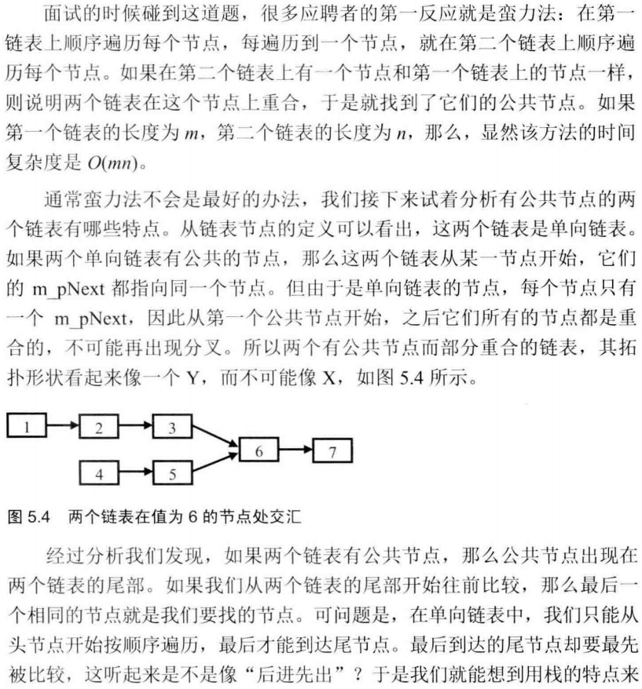
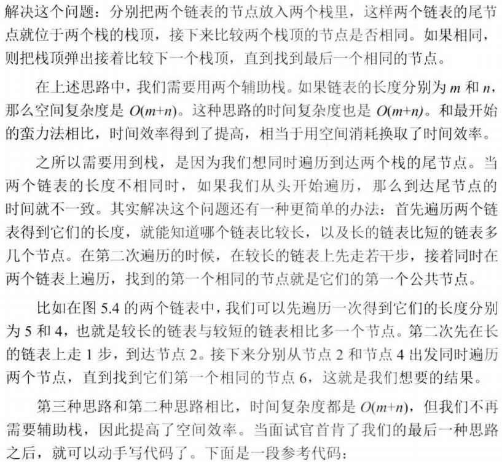

# 052-两个链表的第一个公共结点

tags： 链表 两指针

---

## 题目原文

[牛客网链接](https://www.nowcoder.com/practice/6ab1d9a29e88450685099d45c9e31e46?tpId=13&tqId=11189&tPage=2&rp=1&ru=%2Fta%2Fcoding-interviews&qru=%2Fta%2Fcoding-interviews%2Fquestion-ranking)

输入两个链表，找出它们的第一个公共结点。

## 解题思路





## 代码

### [c++代码](./src/cpp/052-两个链表的第一个公共结点.cpp)

```c++
/*
struct ListNode {
	int val;
	struct ListNode *next;
	ListNode(int x) :
			val(x), next(NULL) {
	}
};*/
class Solution {
public:
    ListNode* FindFirstCommonNode( ListNode* pHead1, ListNode* pHead2) {
        if(pHead1==nullptr||pHead2==nullptr)
            return nullptr;
        int listLength1=GetListLength(pHead1);
        int listLength2=GetListLength(pHead2);
        ListNode* longListNode=pHead1;
        ListNode* shortListNode=pHead2;
        int difLength=listLength1-listLength2;
        if(listLength1<listLength2){
            shortListNode=pHead1;
            longListNode=pHead2;
            difLength=listLength2-listLength1;
        }
        
        for(int i=0;i<difLength;i++){
            longListNode=longListNode->next;
        }
        
        while(longListNode!=nullptr&&shortListNode!=nullptr&&longListNode->val!=shortListNode->val){
            longListNode=longListNode->next;
            shortListNode=shortListNode->next;
        }
        return longListNode;
    }
    int GetListLength(ListNode* pHead){
        if(pHead==nullptr)
            return 0;
        int length=1;
        while(pHead->next!=nullptr){
            pHead=pHead->next;
            length++;
        }
        return length;
    }
};
```

### [python代码](./src/python/052-两个链表的第一个公共结点.py)

```python

```
