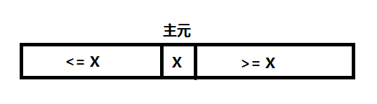
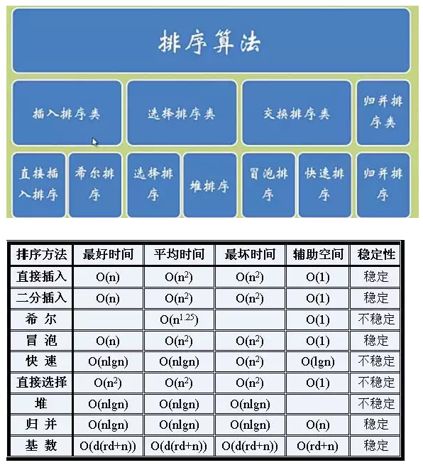

# 排序 快速排序

tags： 排序

---

## 快速排序简介
快速排序（Quicksort），有时也叫划分交换排序，是高效的排序算法。情况好的时候，可以比归并排序和堆排序快大约两三倍。快速排序是一种<font color=red >分治算法</font>，且<font color=red >不需要额外的空间进行排序</font>（原地排序）,节省内存。

快速排序的主要思想是递归与划分。

下图描述了快速排序的过程

![快速排序过程示意图-维基][1]
<center><small> 快速排序过程示意图-维基</small></center>

## 快速排序过程
一、划分：本质上快速排序把数据划分成几份，所以快速排序通过选取一个关键数据，再根据它的大小，把原数组分成两个子数组：第一个数组里的数都比这个主元数据小或等于，而另一个数组里的数都比这个主元数据要大或等于。



二、解决：用递归来处理两个子数组的排序。 （也就是说，递归地求上面图示中左半部分，以及递归地求上面图示中右半部分。）

三、合并：因为子数组都是原址排序，所以不需要合并操作，通过上面两步后数组已经排好序了。

## 快速排序的算法分析
快速排序的运行时间依赖于划分的过程，也就是依赖于划分是否平衡，归根结底还是由输入决定的。

<font color=green >如果划分是平衡的，那么快速排序算法性能就和归并排序一样。</font>

<font color=green >如果划分是平衡的，那么快速排序算法性能就和归并排序一样。
如果划分是不平衡的，那么快速排序的性能就接近于插入排序。</font>

### 最坏的划分

输入的元素已经排序或逆向排序 ，每个划分的一边都没有元素

此时算法复杂度为$\Theta(n^2)$

此时算法的递归树为一个不平衡树

### 最好的划分

当每次划分都将数组划分为n/2和n/2两个部分时是最高效的。

$$T(n)=2T(n/2)+\Theta(n)=\Theta(nlgn)$$

### 平衡的划分

只要划分是常数比例的，算法的运行时间总是$\Theta(nlgn)$

因此一般从序列中随机选取元素作为主元，保证在平均情况下对输入数组的划分是比较均衡的

## 代码
### [c++代码](./src/cpp/快速排序.cpp)

```c++
/**
 * 快速排序的简单代码示例
 */
int Partition(int data[], int length, int start, int end)
{
    if (data == NULL || length <= 0 || start < 0 || end >= length)
        throw new std::exception("Invalid Parameters");

    int index = RandomInRange(start, end);//随机选取主元index
    //这里把index和end对应元素交换是因为，交换后遍历的程序写起来比较简洁明了，遍历结束后将原index对应元素交换到相应位置即可
   //这里index和start对应元素交换也一样，原理相同
    Swap(&data[index],&data[end]);

    int small = start -1;//small是一个标记变量
    for (index=start;index<end;++index){
        //进入if语句前，small对应元素为序列已遍历元素中小于data[end]的索引最大元素
        if(data[index]<data[end]){
            ++small;
            //small+1后，small对应已遍历元素中大于等于data[end]的索引最小元素
            if(small!=index)
                Swap(&data[index],&data[small]);
        }
    }
    //small+1前，索引<=small的元素，均小于data[end]，索引>small的元素均>=data[end]
    ++small;
    //small+1后，small指向序列中大于等于small的索引最小元素
    Swap(&data[small],&data[end]);

    return small;
}
//下面是递归实现快速排序的参考代码
//对于长度为n的数组排序，只需要把start设为0、把end设为n-1，调用函数QuickSot即可

void QuickSort(int data[],int length, int start,int end){
    if (start==end)//递归终止条件
        return;
    int index=Partition(data,length,start,end);
    if(index>start)
        QuickSort(data,length,start,index-1);
    if(index<end)
        QuickSort(data,length,index+1,end);
}
```

### [python代码](./src/python/快速排序.py)

```python
# -*- coding:utf-8 -*-
#下面是Python的list conprehension实现快速排序的例子，短短几行代码，不仅展示出了快速排序的精髓，而且非常pythonic，看了不禁叹服。
def pythonic_quick_sort(a):
    if len(a) <= 1:
        return a
    pivot = a[-1]
    pivots = [i for i in a if i == pivot]
    left = pythonic_quick_sort([i for i in a if i < pivot])
    right = pythonic_quick_sort([i for i in a if i > pivot])
    return left + pivots + right
```

## 排序算法简单总结


## 参考
 1. [【万字总结】快速排序详解与各种线性时间排序对比](http://blog.csdn.net/nomasp/article/details/50359787)

[1]:./img/快速排序过程示意图-维基.gif